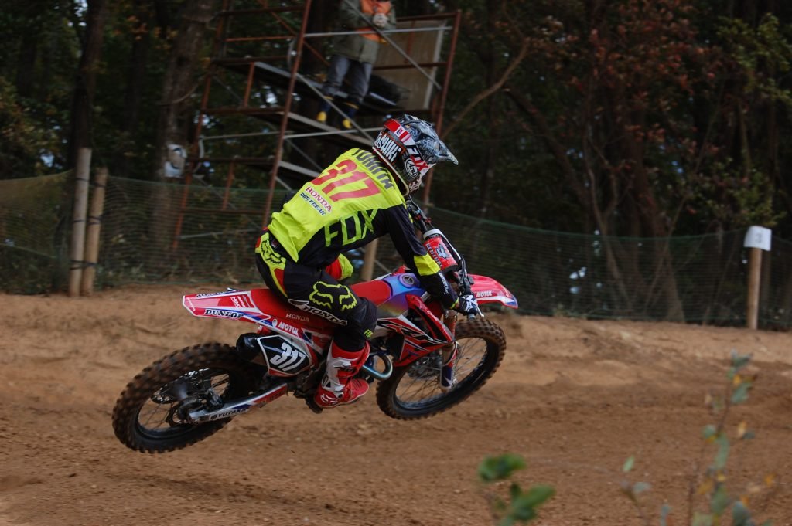
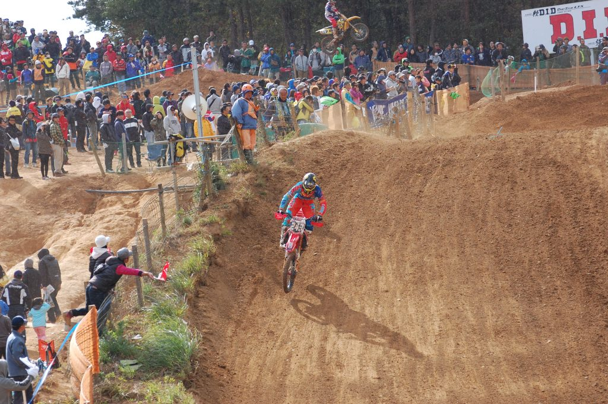
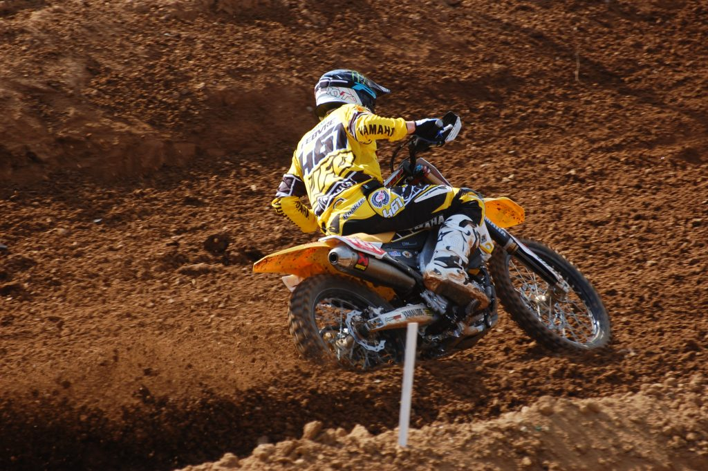
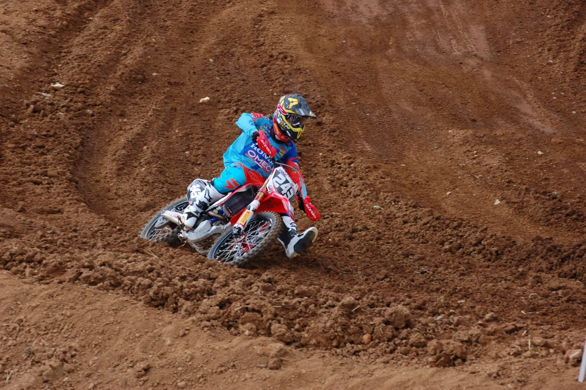
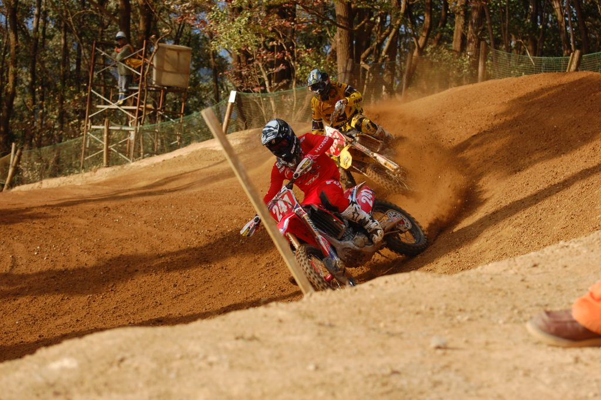
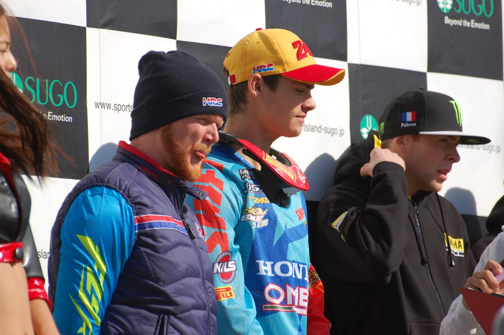

フランスから帰ってきた1ヶ月後くらいに全日本MXの最終戦菅生に外国人ライダーが来るというので観戦に行ってきた。ティム・ガイザー、ロマン・フェーブル、トレイ・カナード、クーパー・ウェブ、ジェレミー・マーティンというアメリカンVSヨーロピアンな対決が観られたのでとても楽しめた。晴れていたのに突然の雨と風と砂埃で観戦するにはなかなかに辛い状況だったけど、そんなことは気にならないくらいに見ごたえのあるレースだった。

