全日本モトクロスの最終戦はこのところ毎年誰かしら外国人が来るので楽しみにしているのだけど、今年はティム・ガイザー、ジェレミー・セーバーの2人がくるらしいので見に行ってみた。アメリカに行ってる富田選手と渡辺選手も帰ってきて出るそうなので、その2人を見る楽しみもあるかなと。結果的には外人2人の圧倒的なスピードを見たことになってしまったけど、仙台で牛タンも食べたし、いろいろ楽しめたので満足。

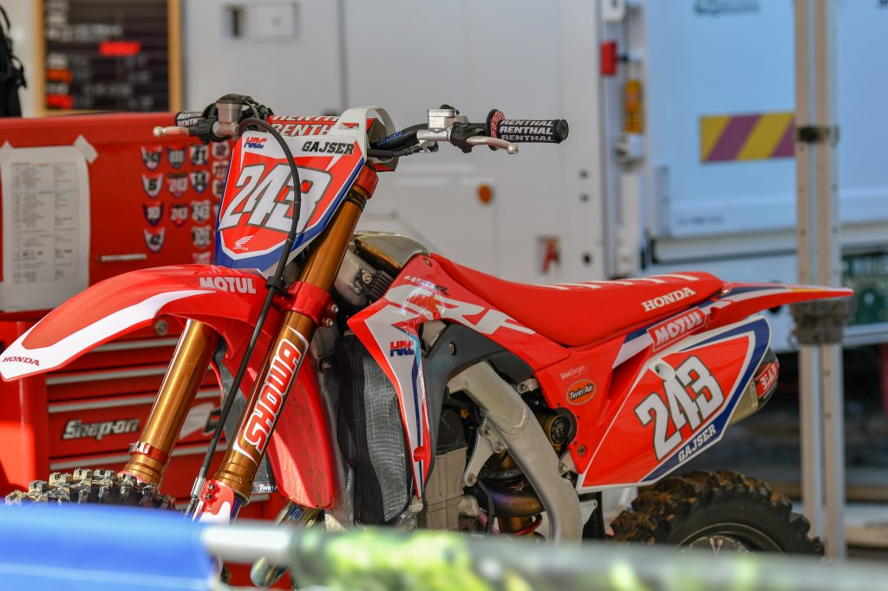

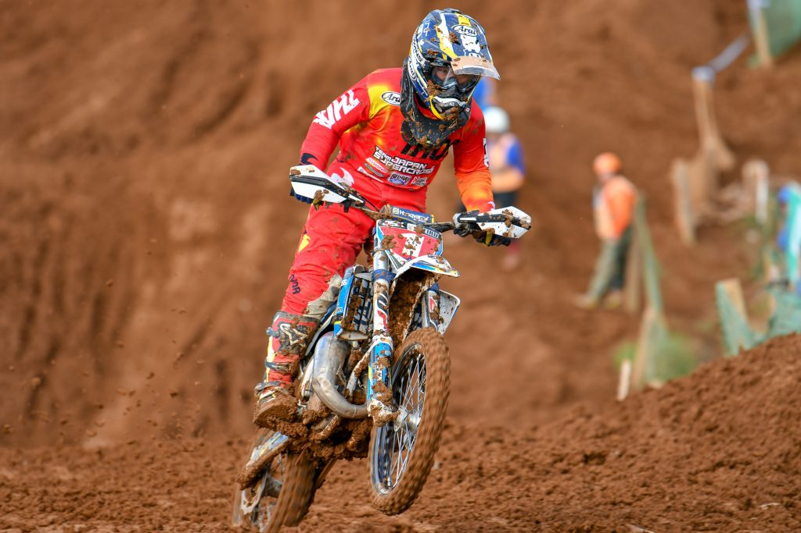

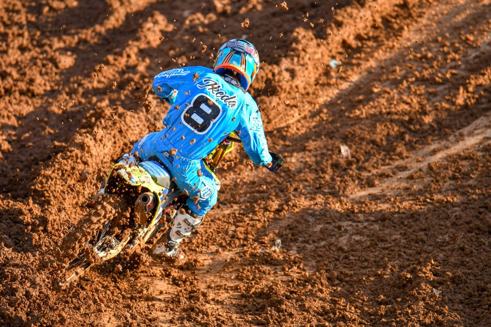

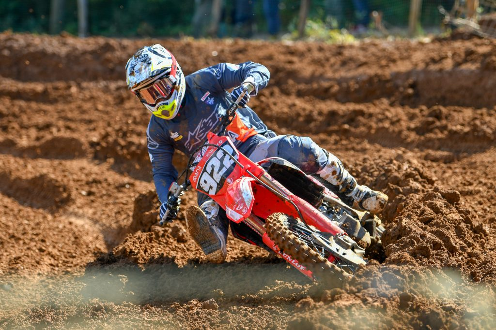

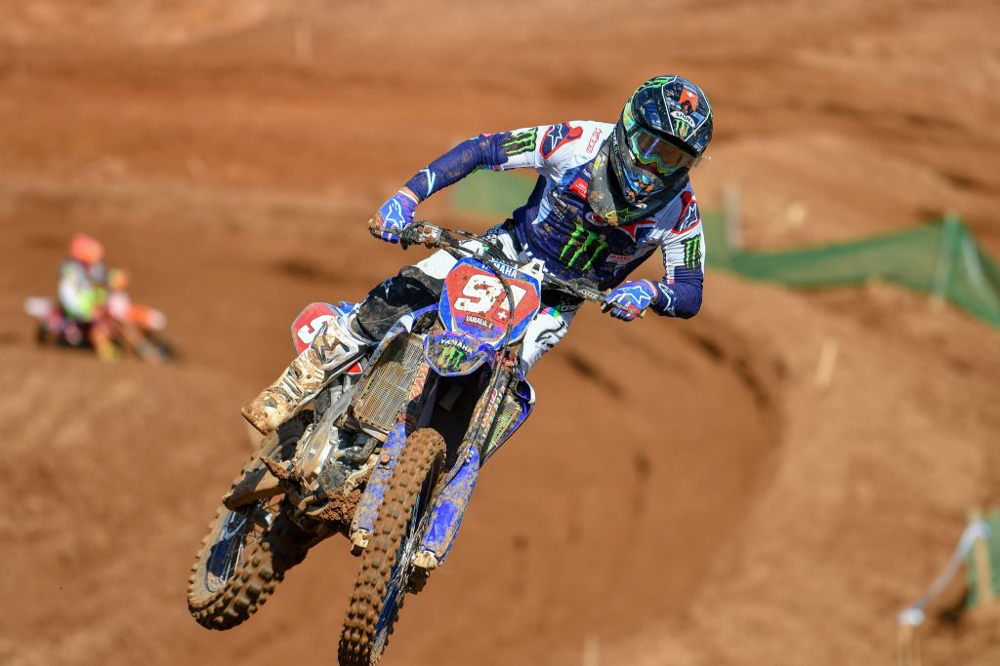

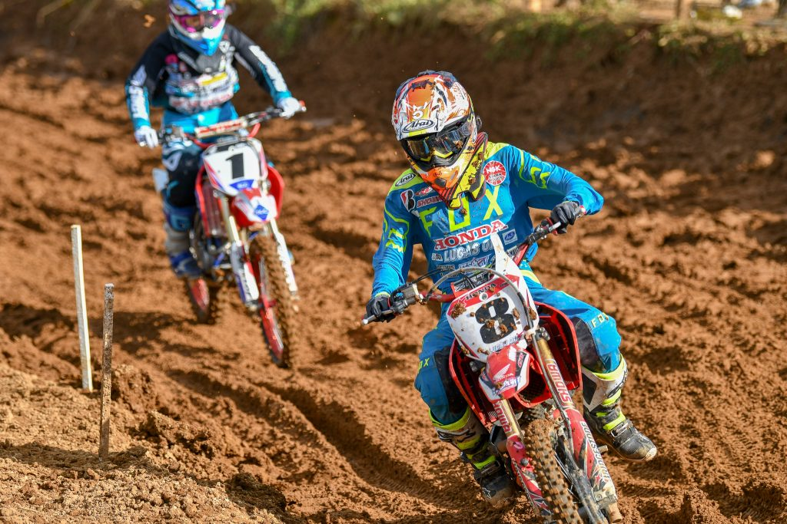

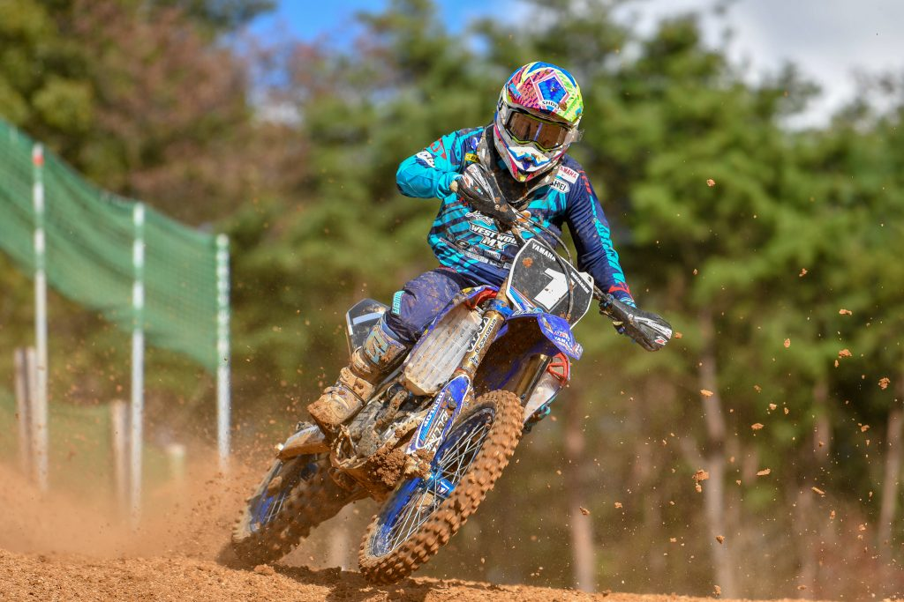

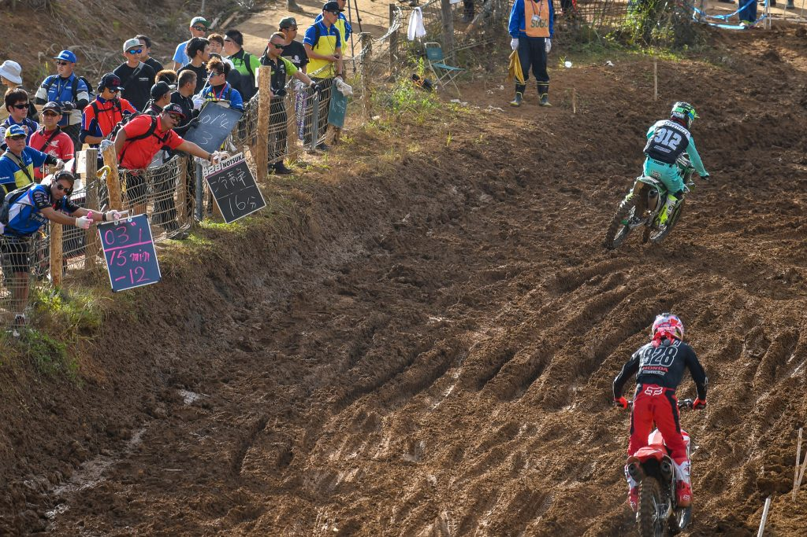

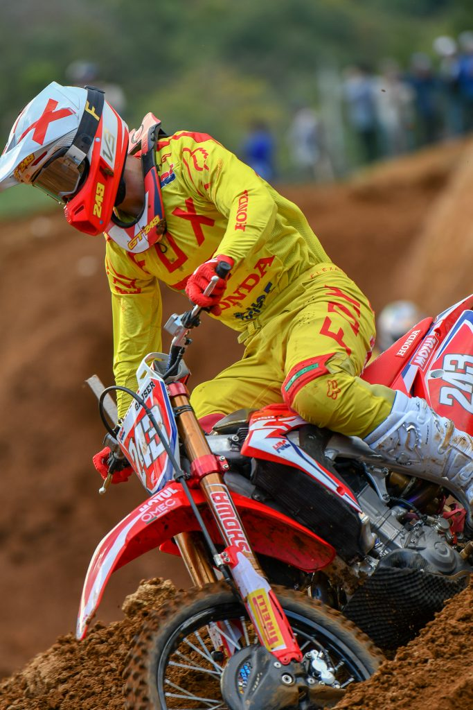

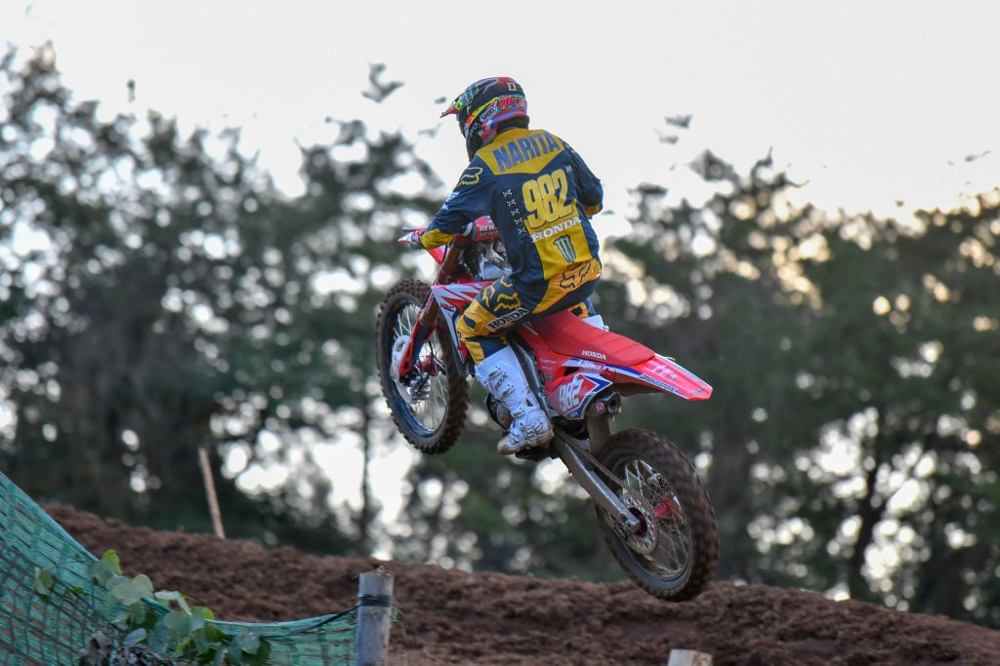

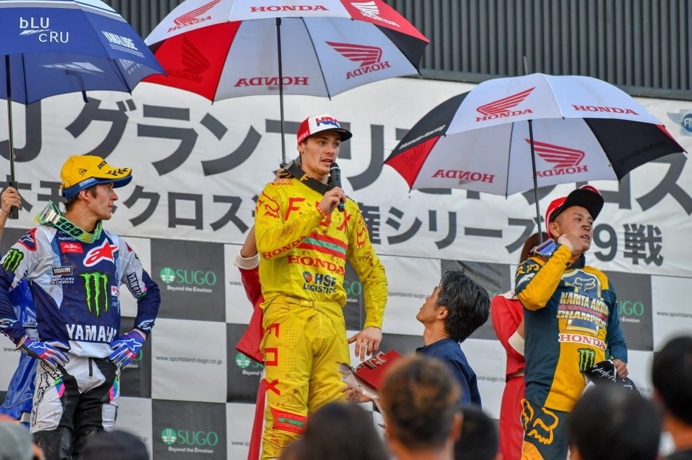
