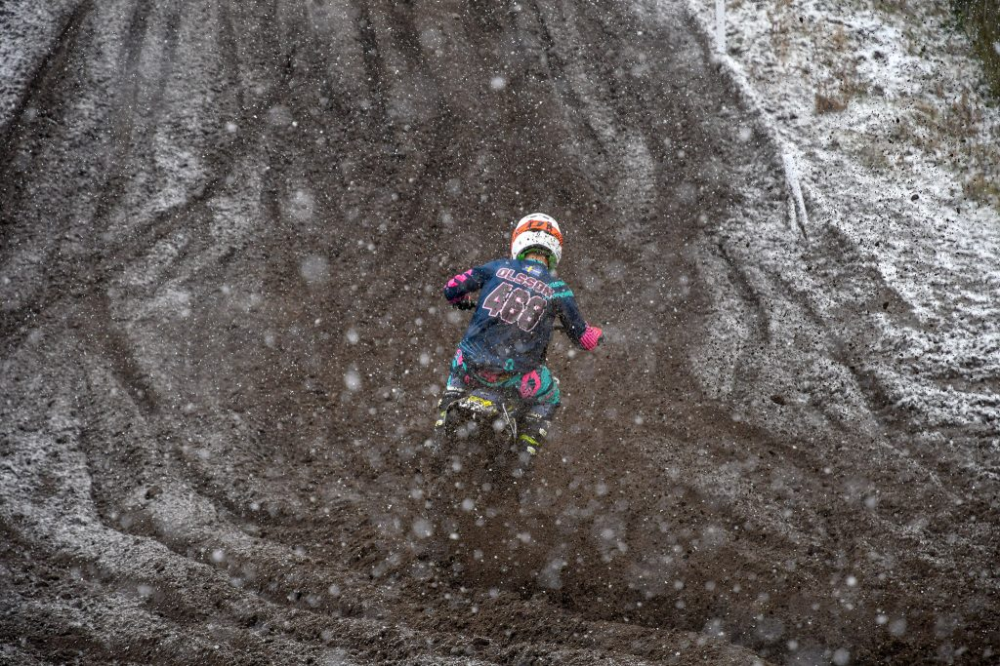
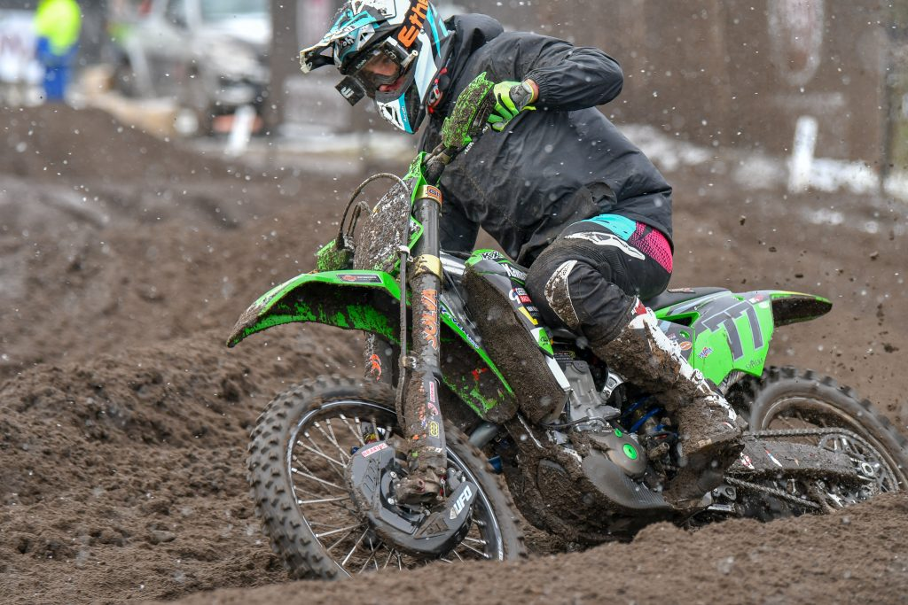
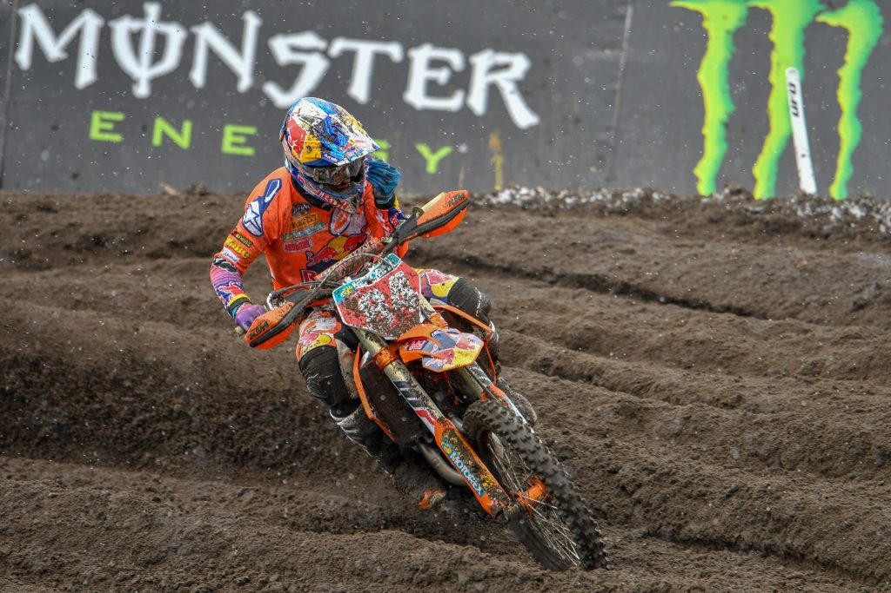
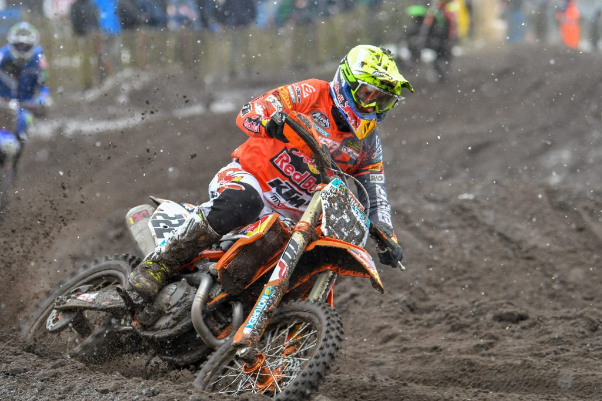
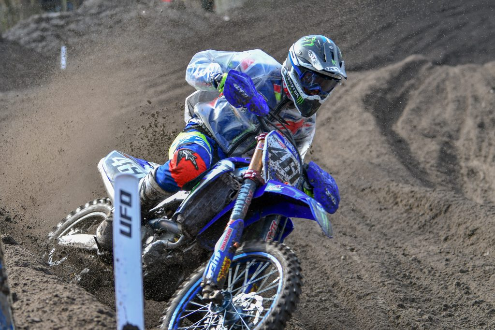
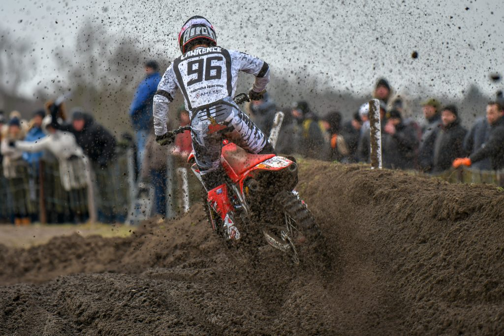
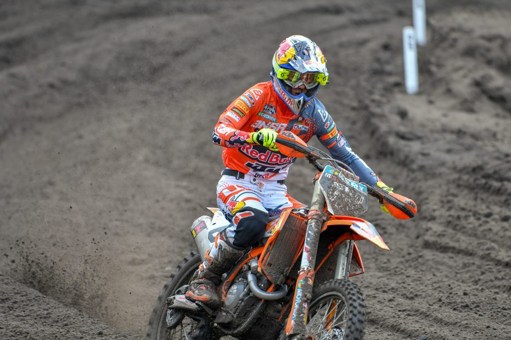
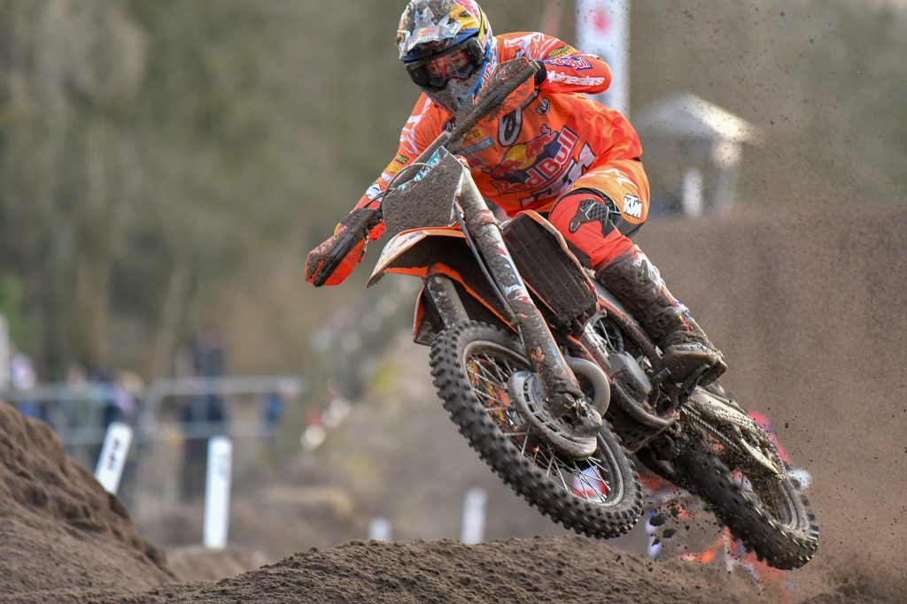

2018年の1回目のMXGP観戦はファルケンスワード。ここは以前から行ってみたかったサーキットだけど、今年は日程が早かったために土日とも雪。最低気温マイナス3度。凍えながらのモトクロス観戦だったけど、ファルケンスワードは今まで見たサーキットの中でナンバーワンだと思った。なにしろ迫力が半端ない。サンド質路面なので開けっぷりが凄いためか、エンジンがヒートして悪臭とも言える凄まじい臭いが会場中に充満していて、具合が悪くなりそう。寒さと臭いでクラクラしながら撮った写真がコチラ。

