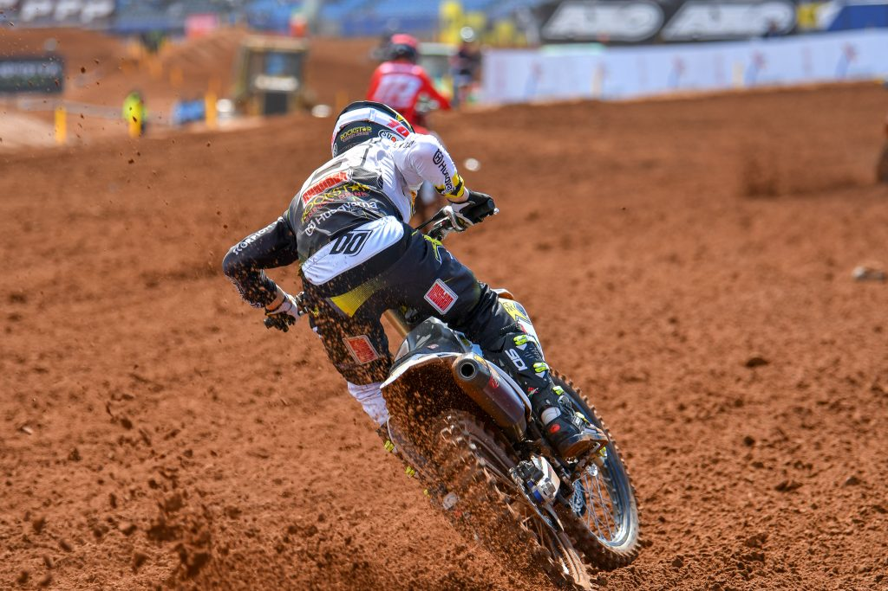
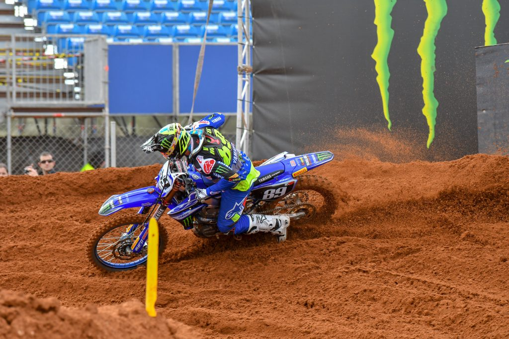
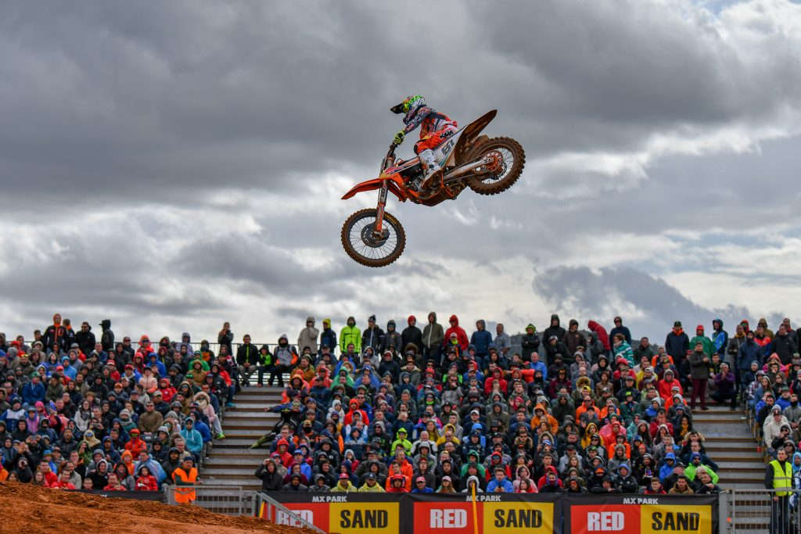
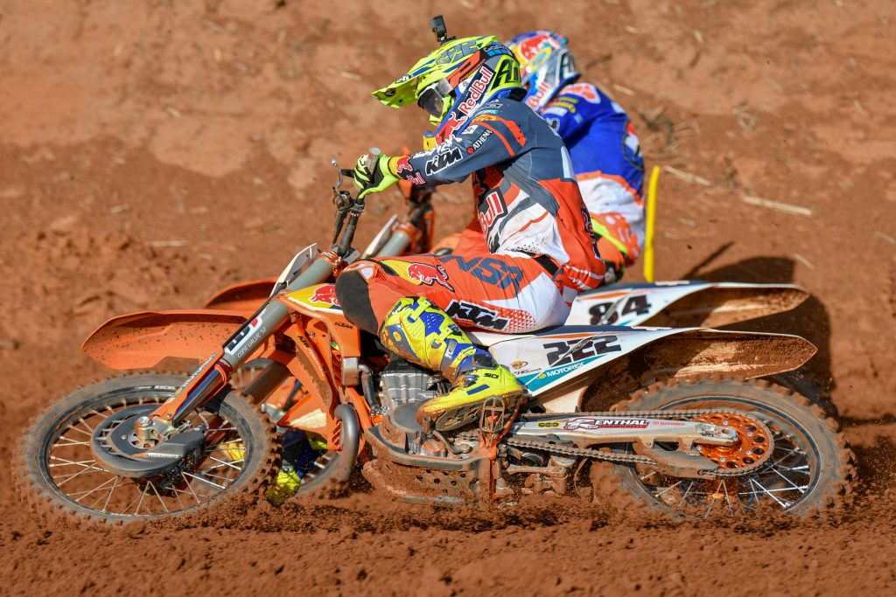
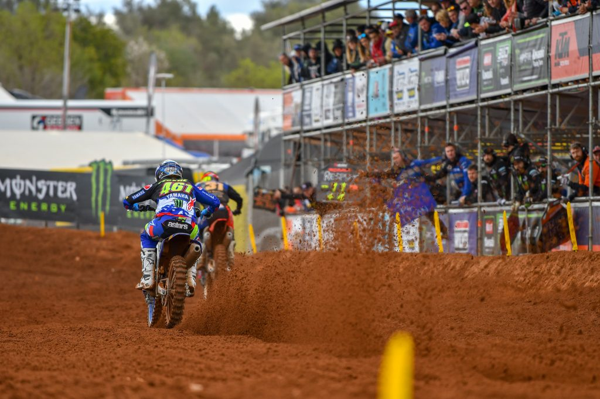
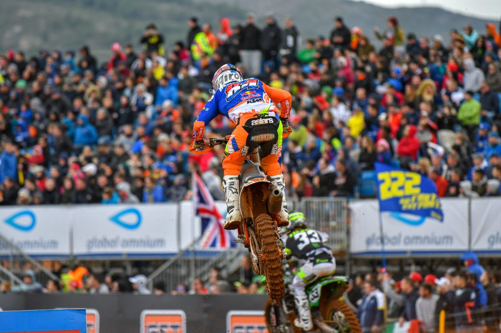
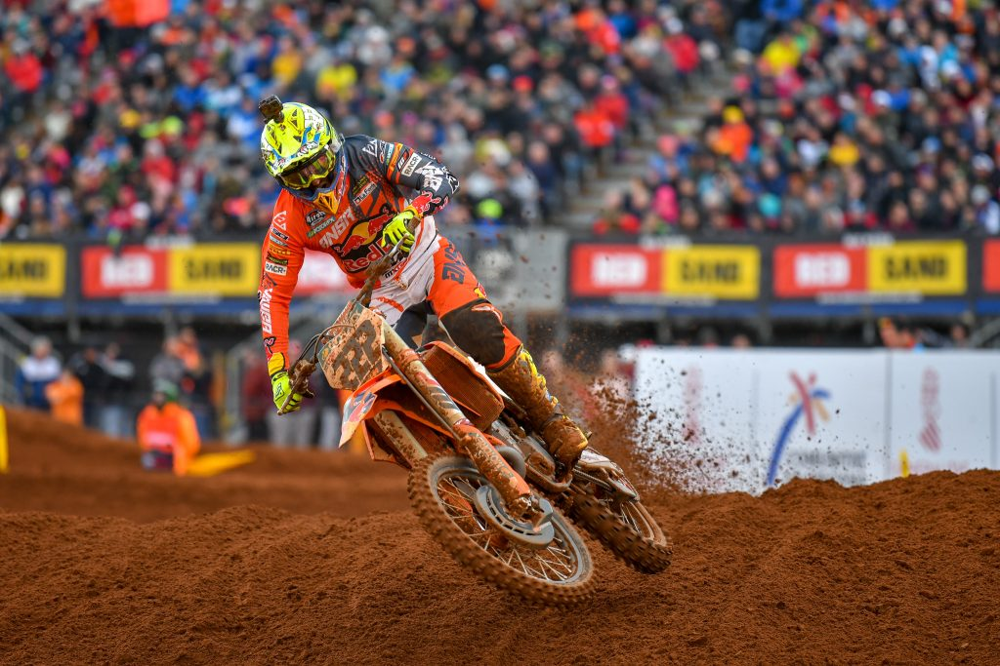
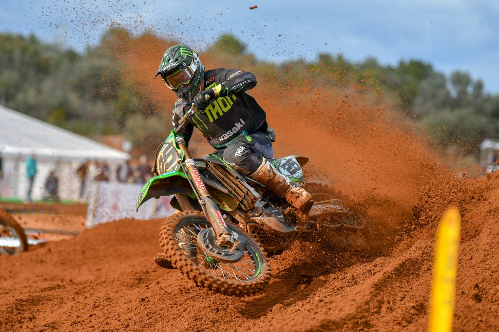
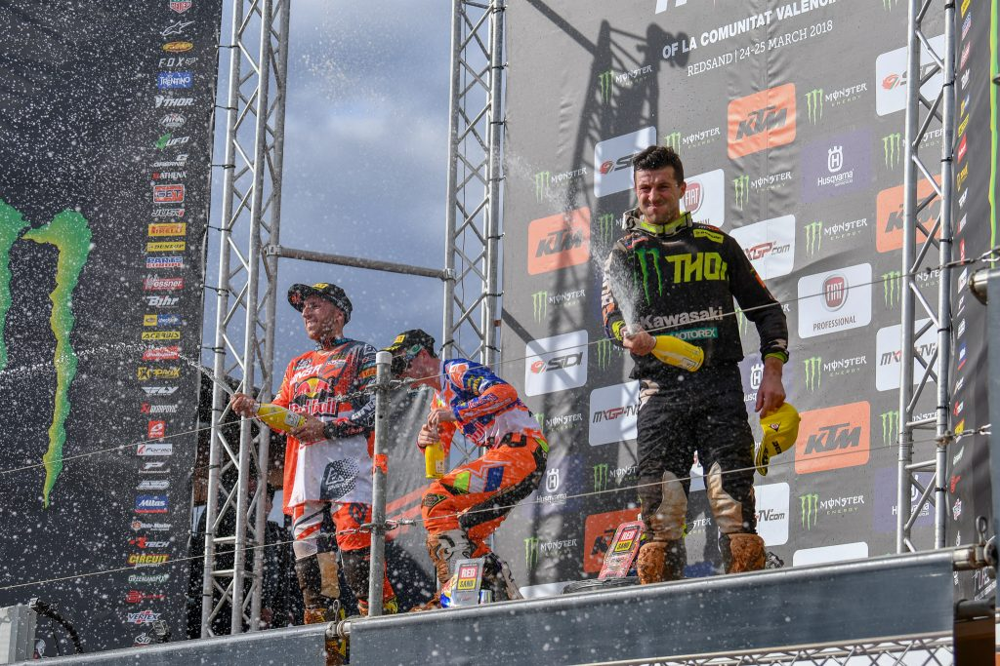

スペインのレッドサンドサーキットは名前の通り赤土の人工トラックで、MXGPは今回が初開催だと思う。今回初めてメディアパスとフォトビブを手に入れてトラックの内側から写真を撮ることができた。内側に入ってみるといろいろと気をつけなければならないことが多く、気を使うためにとても疲れたように思う。レース展開はファルケンスワードと違ってカイローリが速く1-1で勝ったため、オランダとスペインでハーリングスとポイントを分け合ったような形になった。

