2018年のMXoNはアメリカのレッドバッド。ここはAMAナショナルでもとても盛り上がる開催地で、誰かがレッーバッー！と言い始めるとみんなそれに合わせてレッーバッー！と合言葉のように始まってしまう。しかもトンネルの中で言うのが好きらしく、音が響くからだと思うけどやかましいったらありゃしない。とはいえアメリカ人はこうやって楽しむのが上手いなぁと妙に関心もしたのだけど。

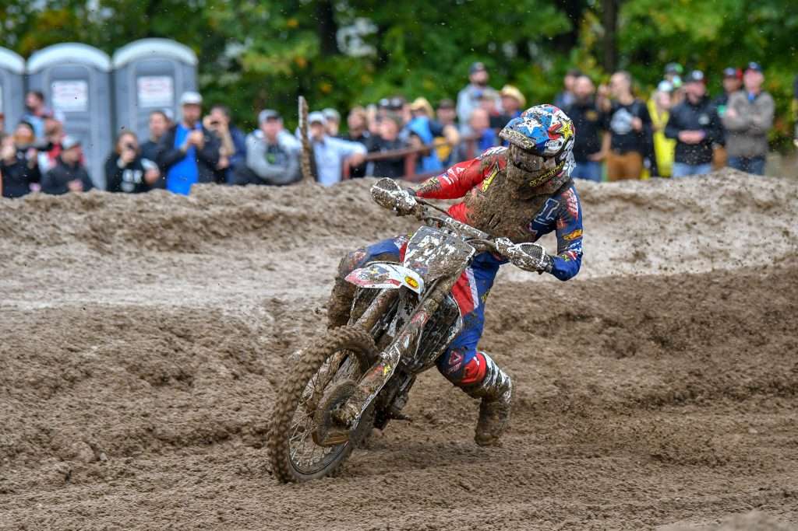

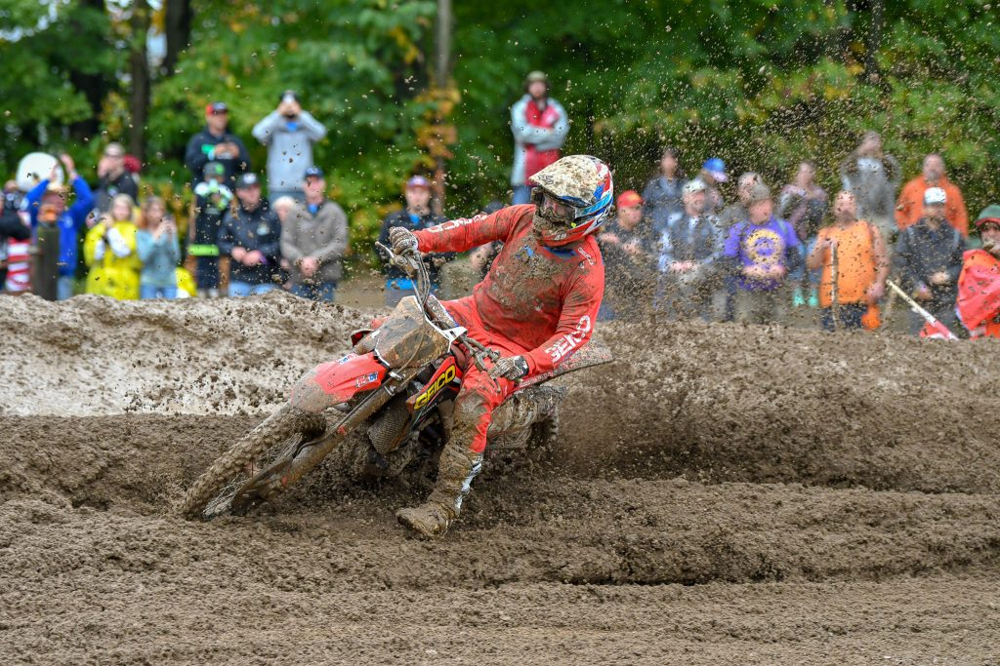

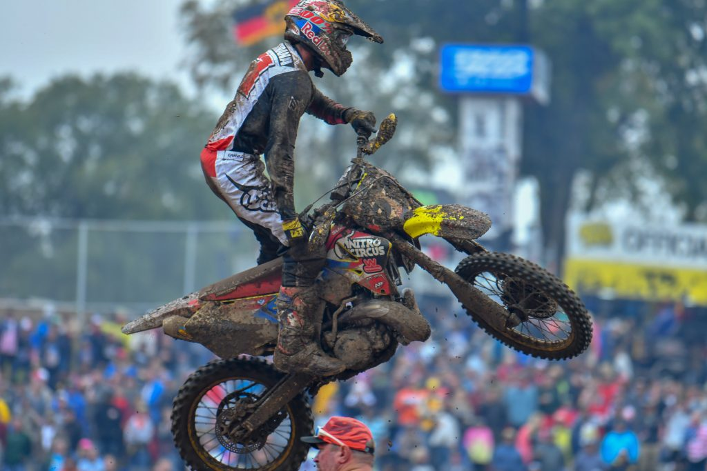

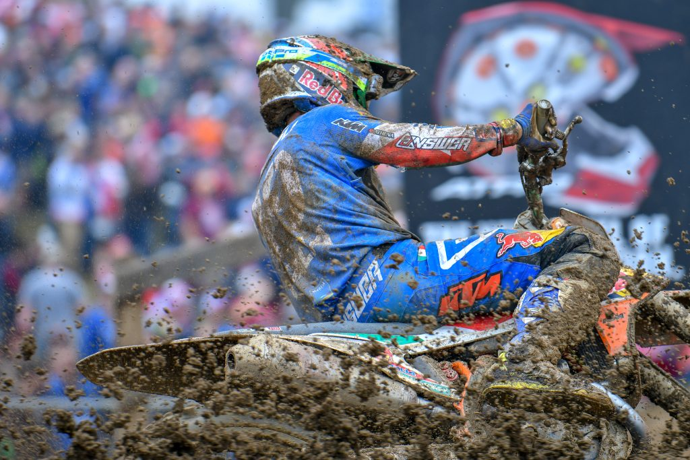

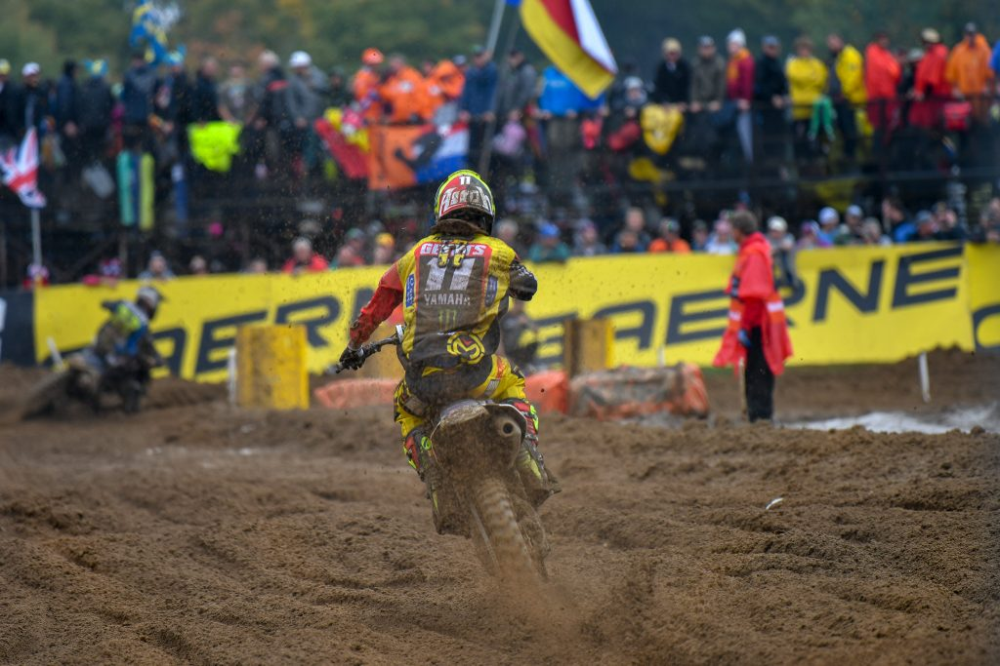

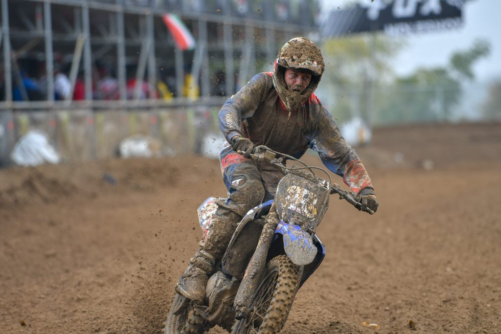

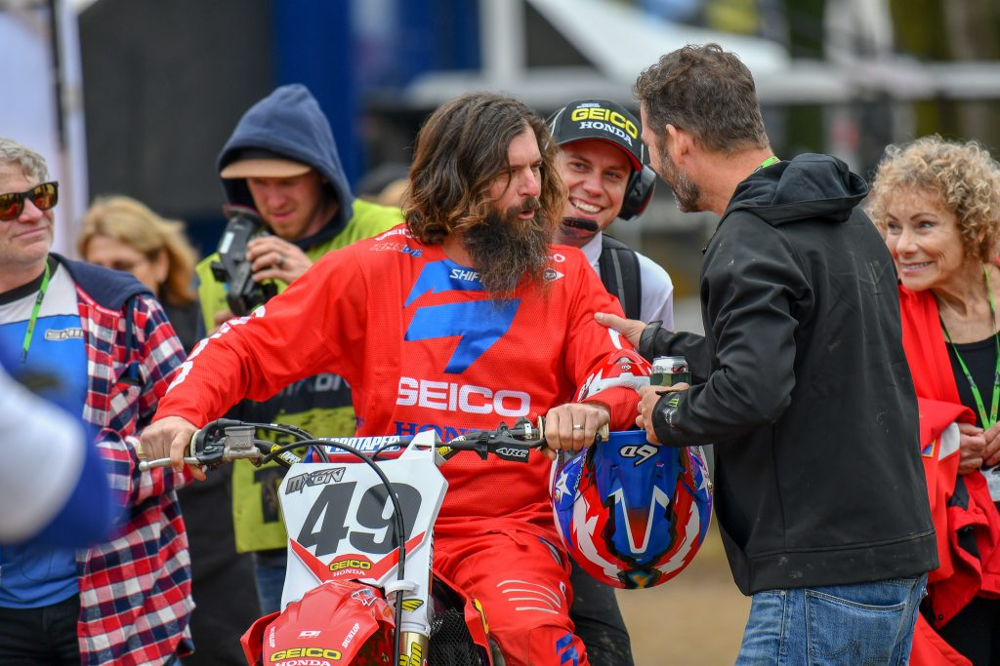

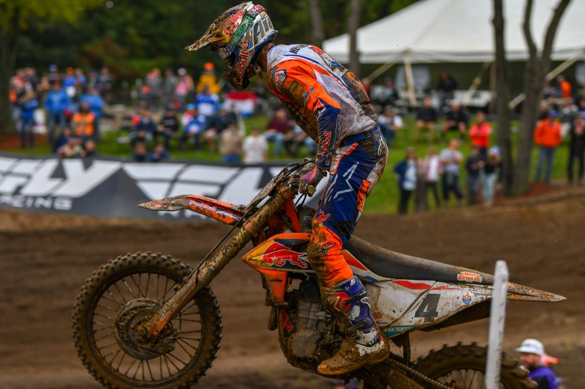

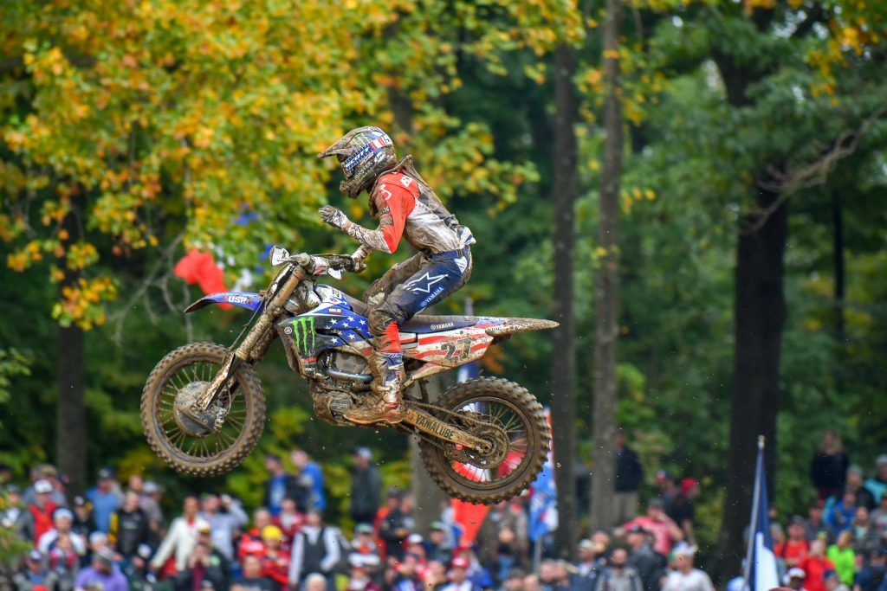

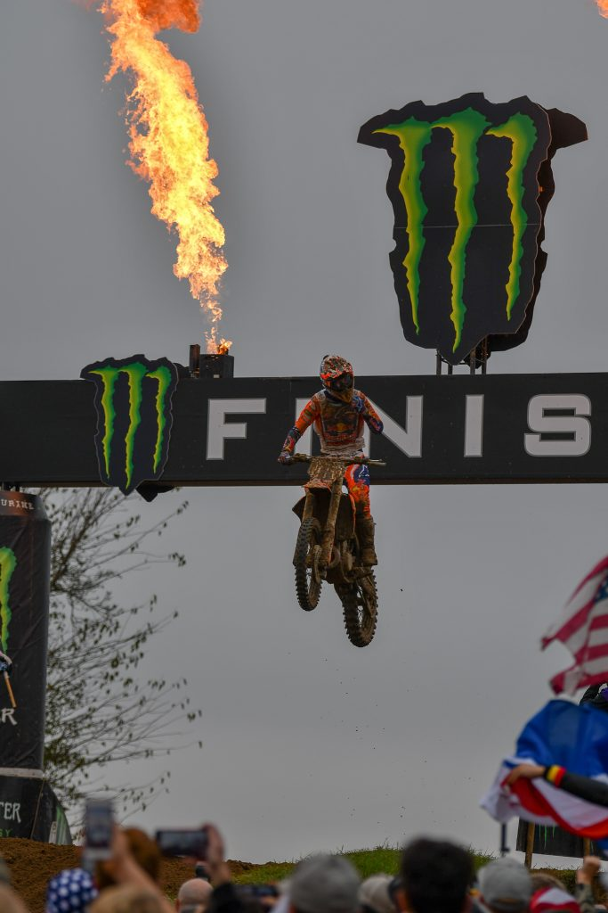

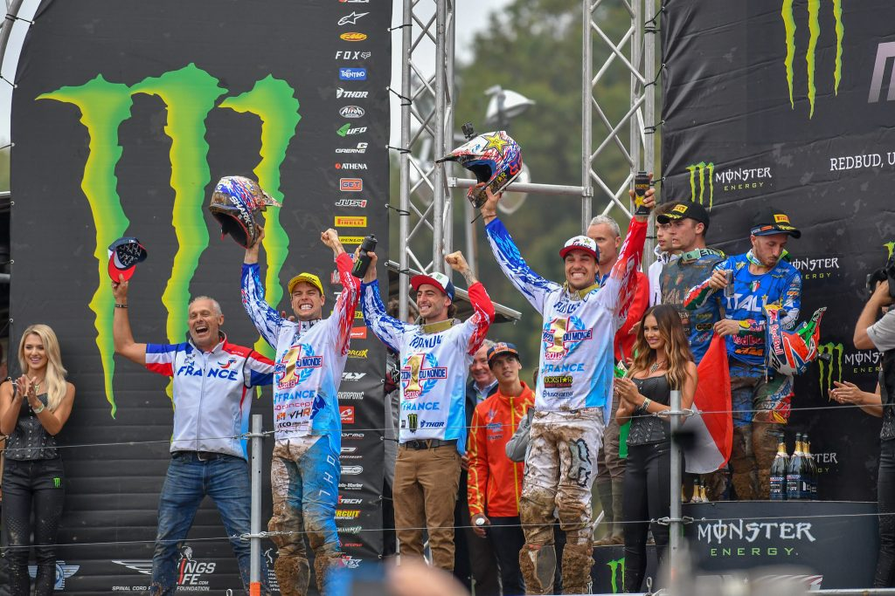
