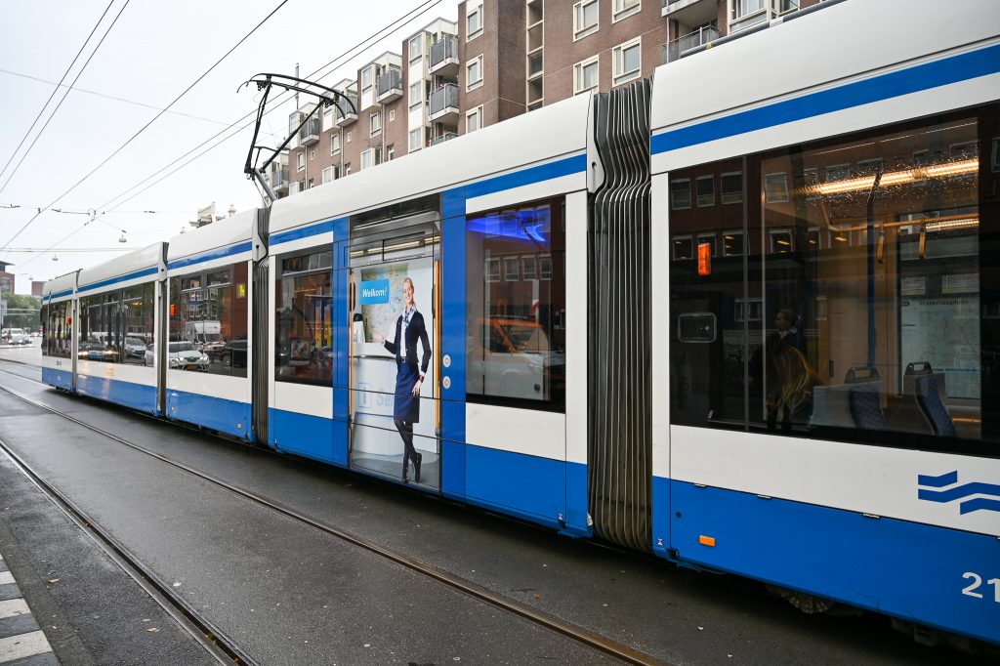
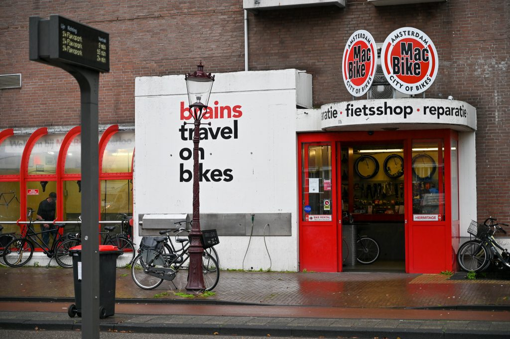
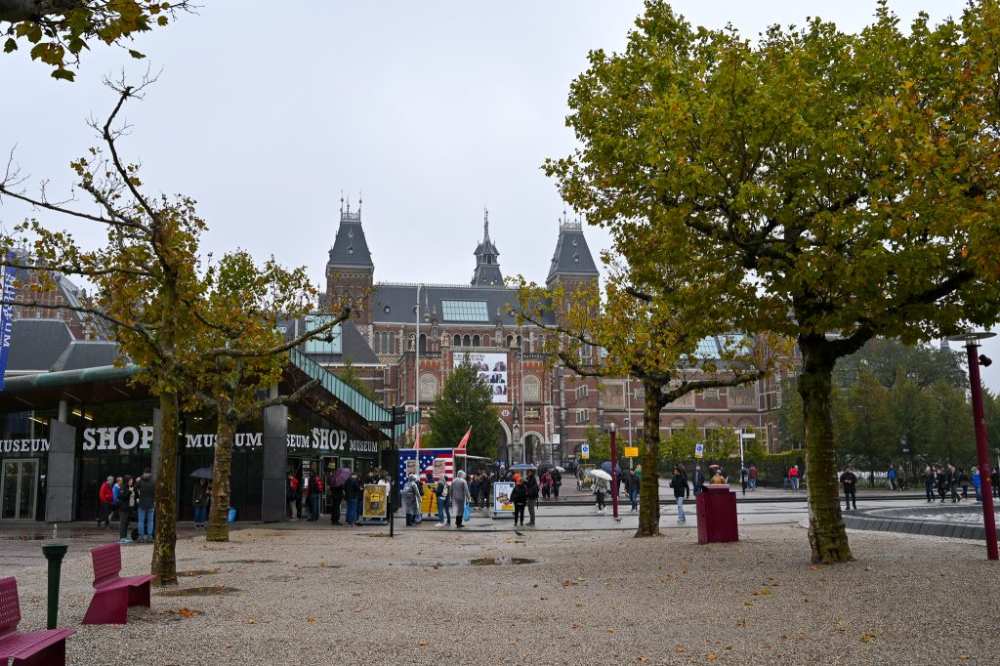
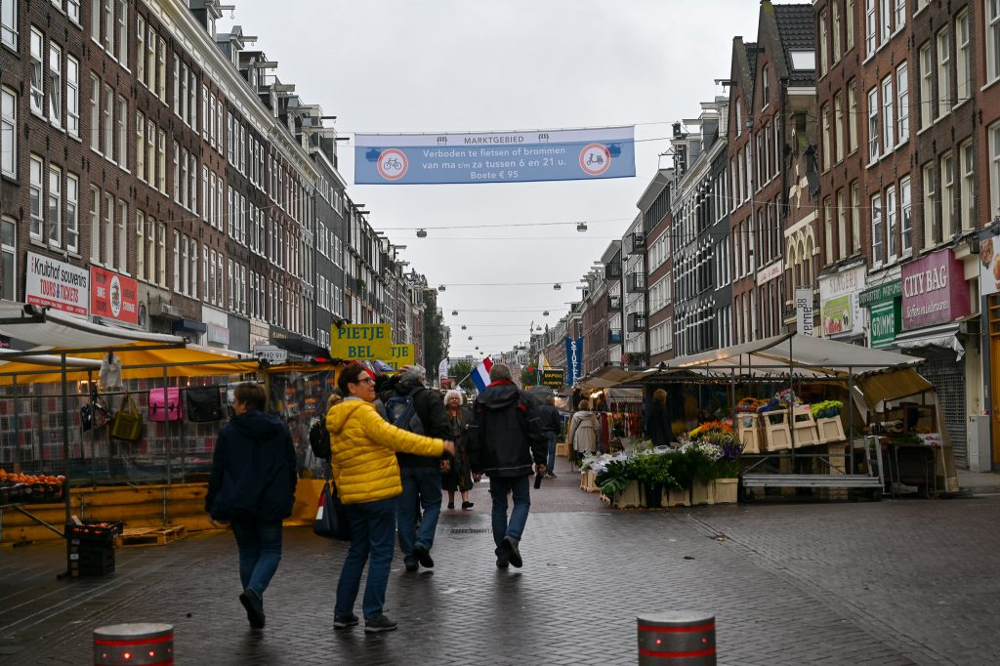
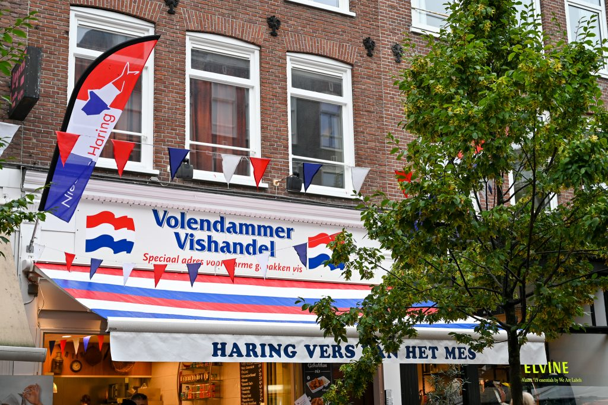
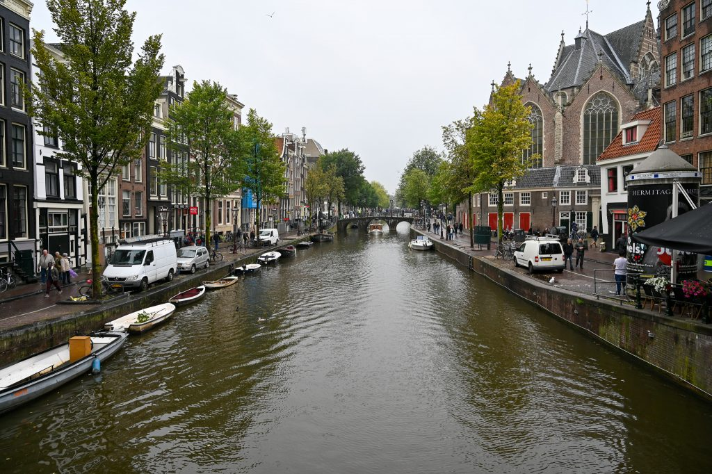

去年も来たアムステルダム。今年は去年行かなかったゴッホ美術館に行ったり、マーケットを見たりしてみた。二度目の訪問で印象が多少なりとも変わるかと思いきや、最初の印象と変わらず騒がしくて落ち着かない街だった。

<figure>

<figcaption>

トラムに乗ってゴッホ美術館に移動

</figcaption>

</figure>

<figure>

<figcaption>

アムステルダムにはレンタル自転車屋がたくさんある

</figcaption>

</figure>

<figure>

<figcaption>

アムステルダム国立美術館は立派な建物であった。

</figcaption>

</figure>

<figure>

<figcaption>

アルバートクイップマーケットの入り口。

</figcaption>

</figure>

<figure>

<figcaption>

去年は食べなかったハーリング。今年はこのお店で食べてみたけど、うーん、微妙。

</figcaption>

</figure>

<figure>

<figcaption>

アムステルダムらしい景色

</figcaption>

</figure>
