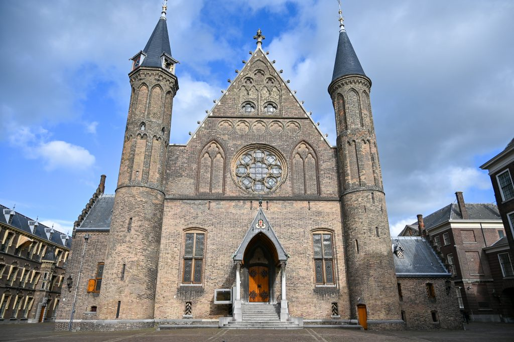
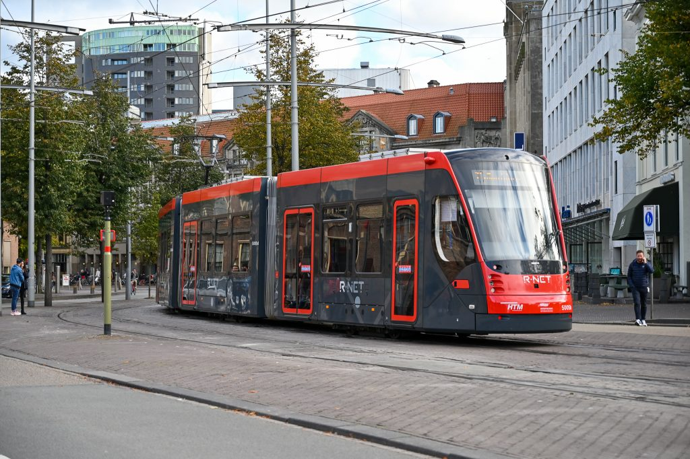
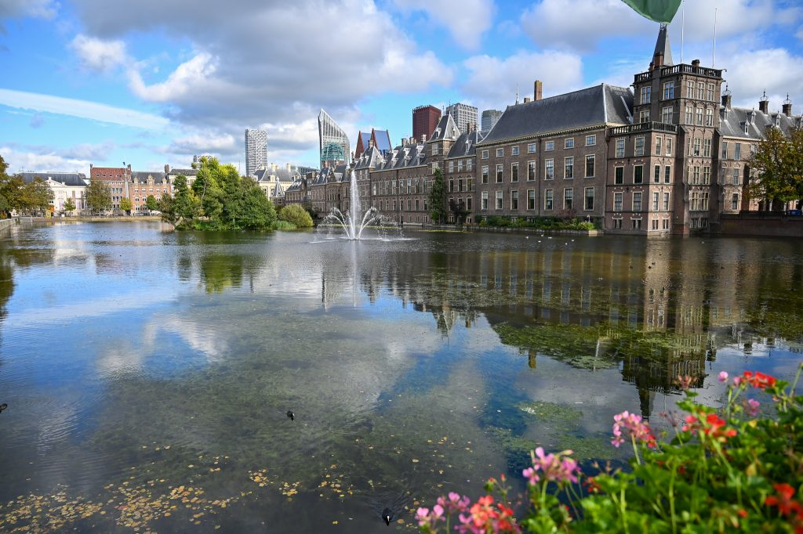
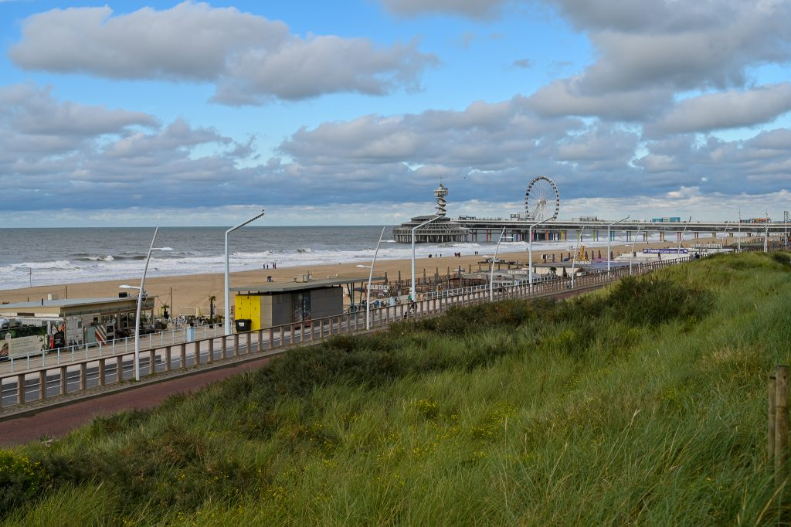
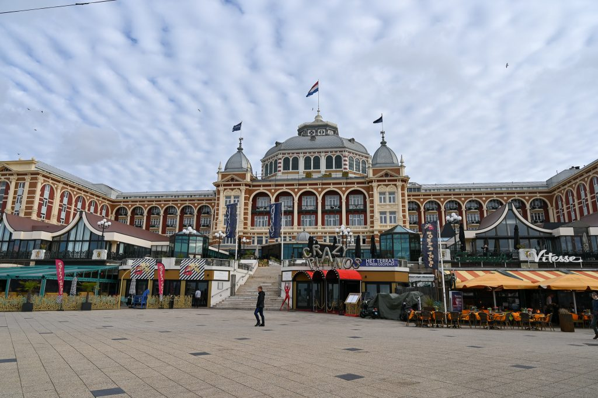
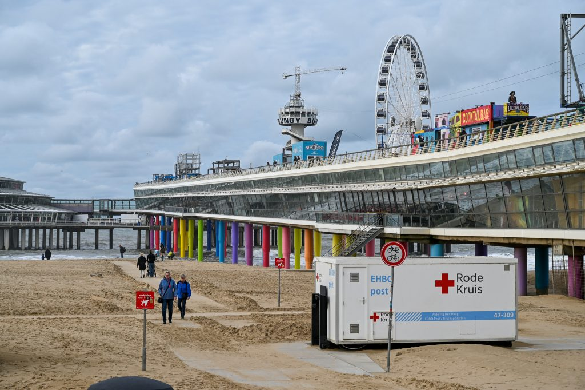
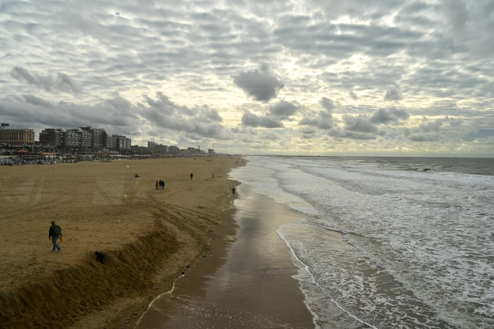

レースが終わった翌日は空港へレンタカーを返して、アムステルダムではなくハーグに移動。なんとなく別の街へ行ってみたかったのと、ハーグの近くにスケベニンゲンビーチがあったので、せっかくだから行ってみようと思ったので。ビーチはなかなか素敵だったけど、ちょっと寂しい感じもした。

<figure>

<figcaption>

ビネンホフの中側にあるなんていう建物なんだろ？教会みたいだけど違うのかな？

</figcaption>

</figure>

<figure>

<figcaption>

ハーグのトラムは最新式から旧式なやつまでいろいろだった。

</figcaption>

</figure>

<figure>

<figcaption>

ビネンホフを池側から撮ると綺麗ですな。

</figcaption>

</figure>

<figure>

<figcaption>

トラムに乗ってスケベニンゲンに移動

</figcaption>

</figure>

<figure>

<figcaption>

クールハウス・ホテルの建物はやけに豪華

</figcaption>

</figure>

<figure>

<figcaption>

観覧車は海の上にあってそこまで歩いていけるのだけど、その橋が２階建て構造になっていて、下側はゲーセンみたいになってる。でも閑散期なのかガラーンとしてて寂しげだった。

</figcaption>

</figure>

<figure>

<figcaption>

北海になるのかな？は泥水みたいな色。そういえばモン・サン・ミッシェルの海もこんな色だった。

</figcaption>

</figure>
