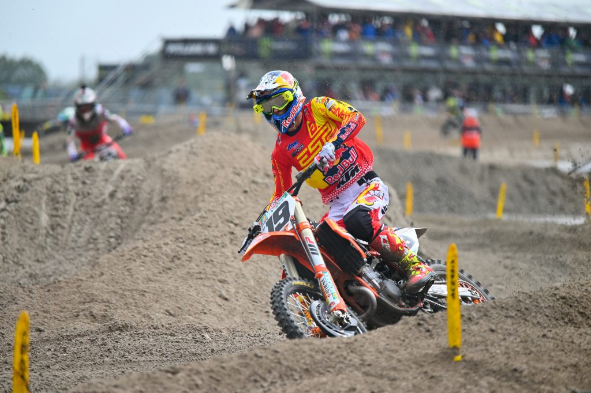
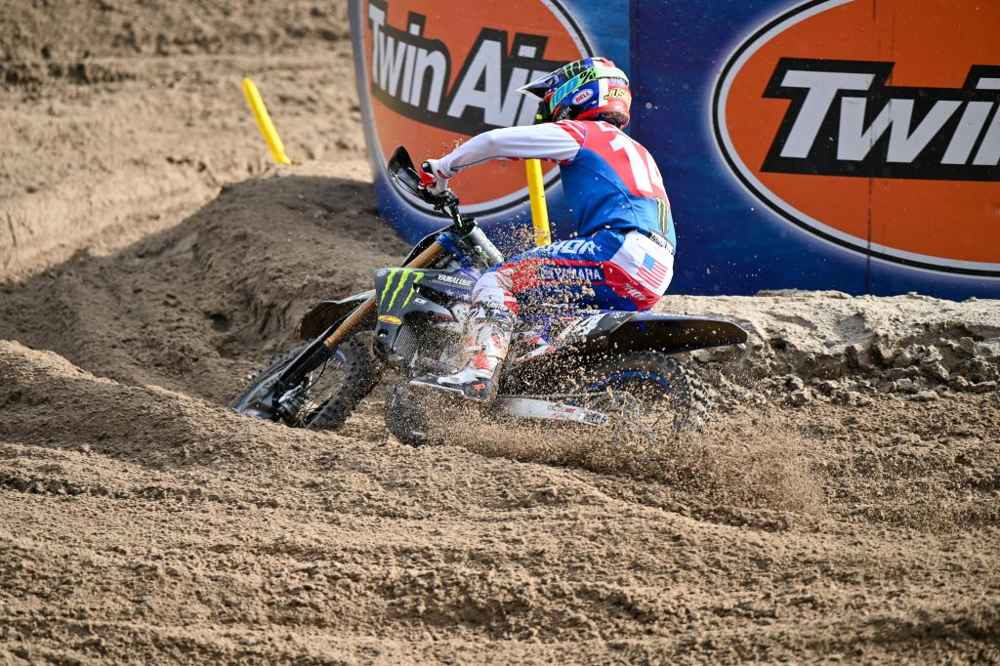
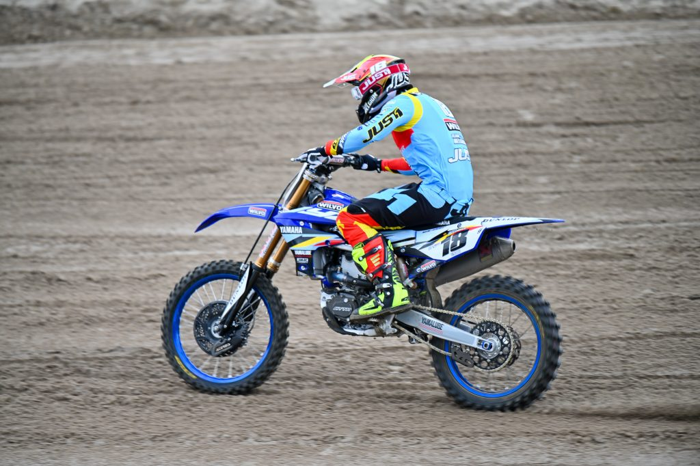
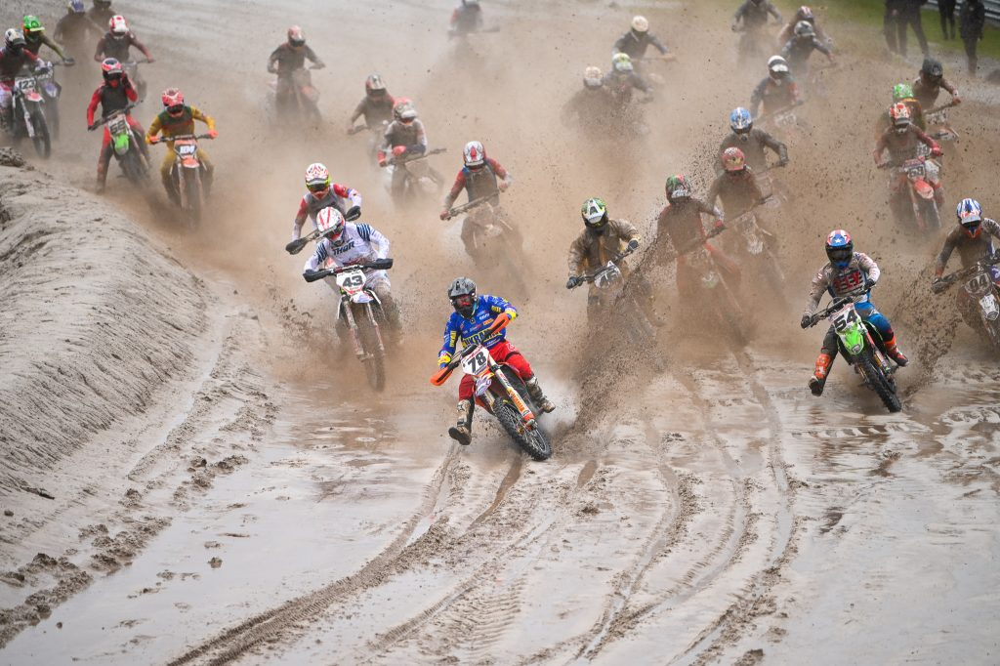
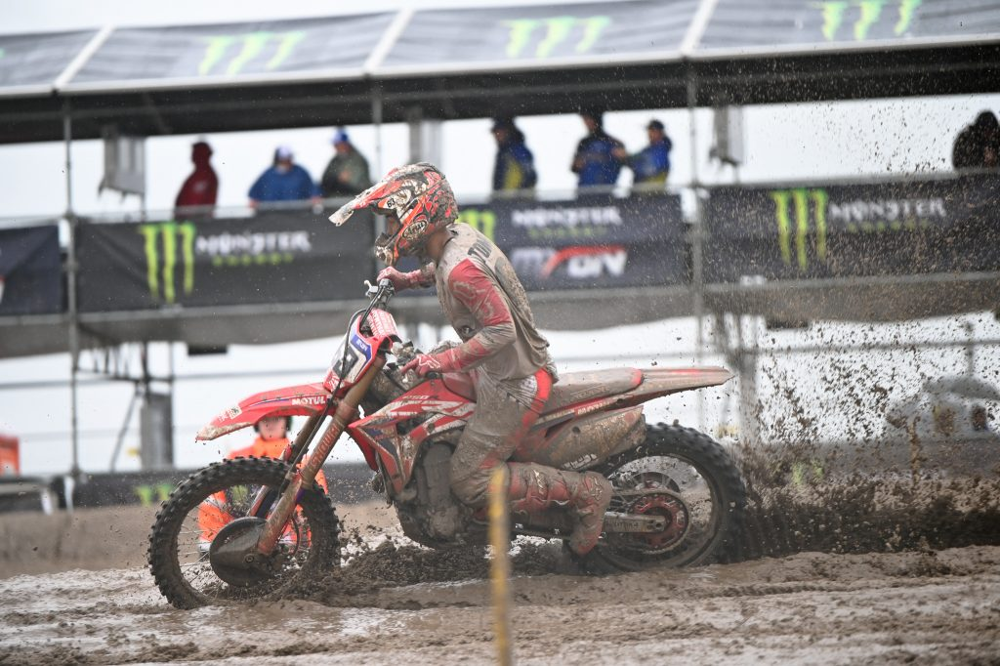
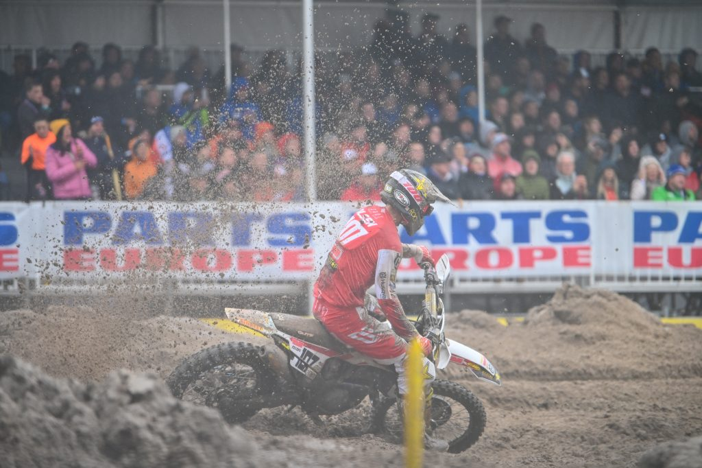
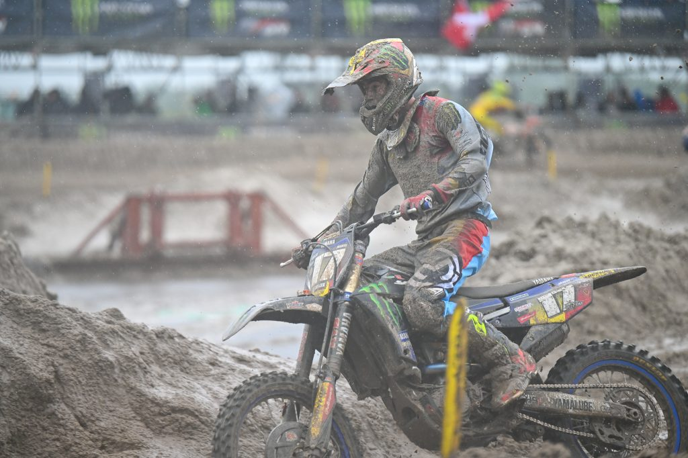
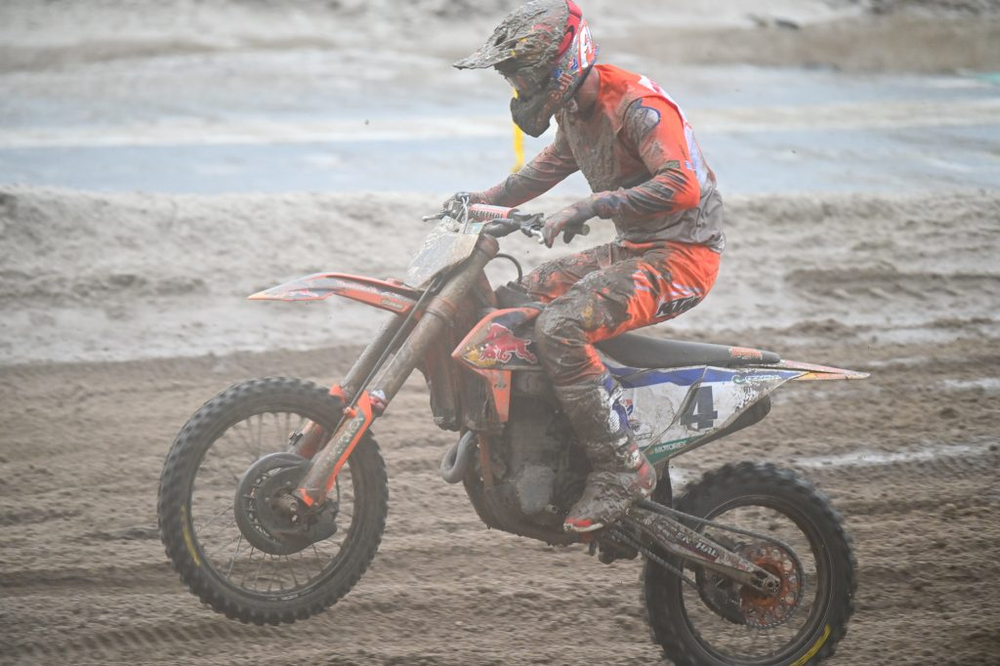
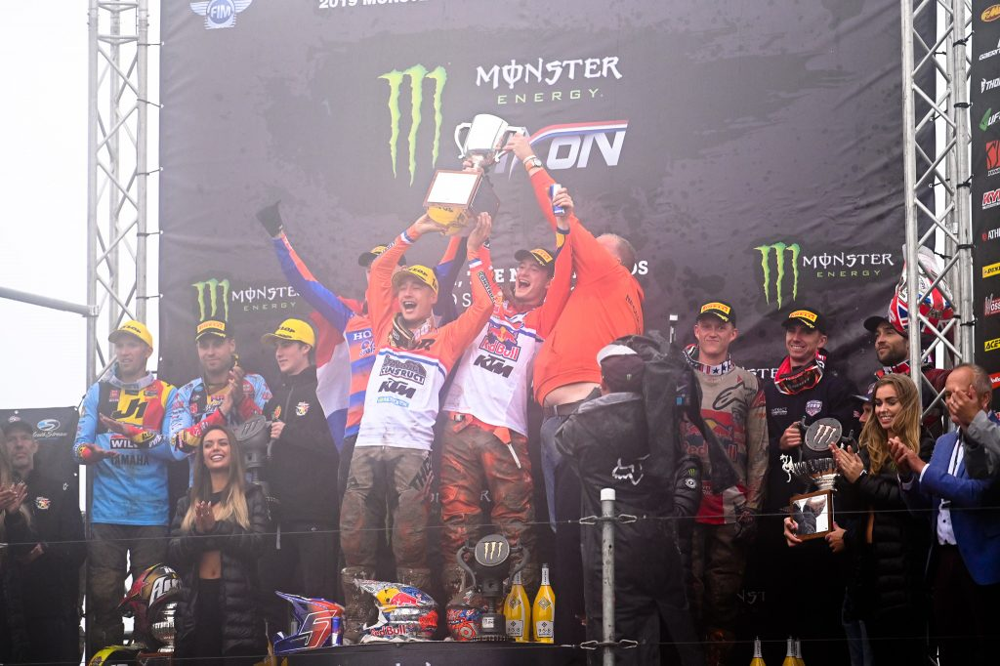

今年の最初のヨーロッパ旅行がMXoNになってしまったのは仕事が忙しかったから。会場はアッセンTTサーキット。ロードサーキットに砂を盛って作るんだけど、こんなに大量に砂を撒いていいのだろうかと、つい片付けの心配をしてしまう。グランドスタンドからの眺めは思ったほど悪くなくて、これはこれでありだなと。

<figure>

<figcaption>

予選の1レース目はMXGPクラス。プラドはトップで飛び出し、450への対応力を見せる。でもやはり練習不足なのか、途中で順位を落とす結果に。来年がとても楽しみ。

</figcaption>

</figure>

<figure>

<figcaption>

ジャスティン・クーパーはホールショットからトップでチェッカーを受ける。予選は良かったんだけどね、USA…。

</figcaption>

</figure>

<figure>

<figcaption>

ストライボスは今回とても活躍していたんじゃないかと思う。予選レースでホールショット。まだまだやりますね。

</figcaption>

</figure>

<figure>

<figcaption>

Bファイナルのスタート。一番雨がひどかったのでトップで出ないとあっという間に泥だらけ。

</figcaption>

</figure>

<figure>

<figcaption>

Bファイナルの富田選手。Bファイナル走らなきゃならないような展開にはできればしたくないですね。1位で通過したとしても決勝レースがすぐにあるので、体力的にとてもつらい。

</figcaption>

</figure>

<figure>

<figcaption>

TKOはいつでもかっこいいなぁ。写真映えするライダーの一人。

</figcaption>

</figure>

<figure>

<figcaption>

ゴーグルなしで顔が死んでるヤーゴ。大丈夫か〜？

</figcaption>

</figure>

<figure>

<figcaption>

ハーリングスはまだいまいちで、いつものスタート出られないから追い上げパターン。

</figcaption>

</figure>

<figure>

<figcaption>

ハーリングスがいまいちだったとしてもコールデンホフが1-1を取って、余裕で勝ってしまうオランダ。自国開催でしっかり勝ててよかった。

</figcaption>

</figure>
