GPが始まる前のプレシーズンのレースを見に行ってみたいと前から思っていたので、今年イギリスのホークストーンパークに行ってみた。しかし、レース当日にキアラという嵐が来てしまい、天候は最悪。途中でカメラが壊れてしまい、十分に写真が撮れなかったけど、それでも楽しめたので行ってよかった。

<figure>

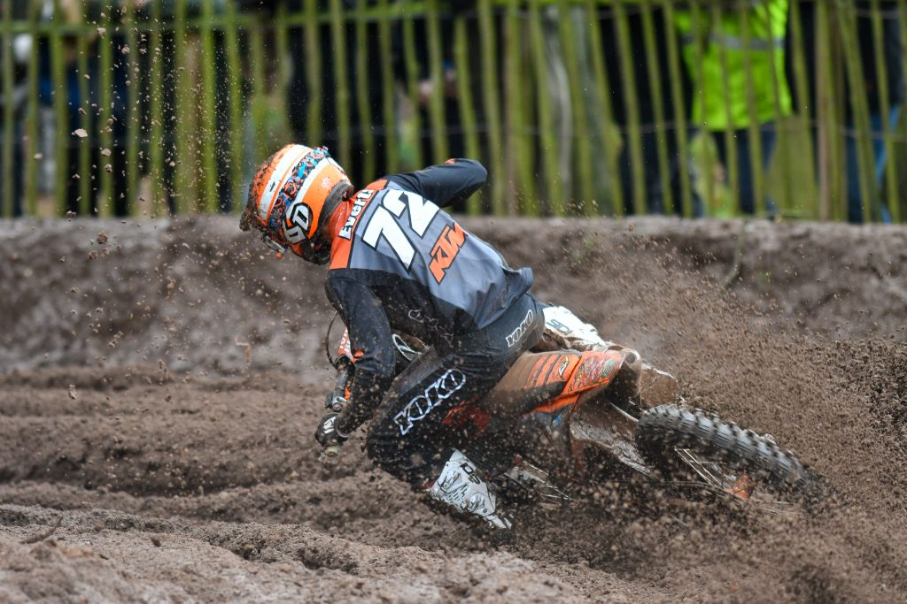

<figcaption>

このレースで楽しみにしていたのはステファン・エバーツの息子リアム・エバーツの走りが見れること。ステファンのような独特のスタンディング中心のライディングではなく、ごく普通のライディングフォームだけど、アグレッシブさが際立つのは若さなのか、それともリアムらしさなのか。結果は2-1で総合優勝。

</figcaption>

</figure>

<figure>

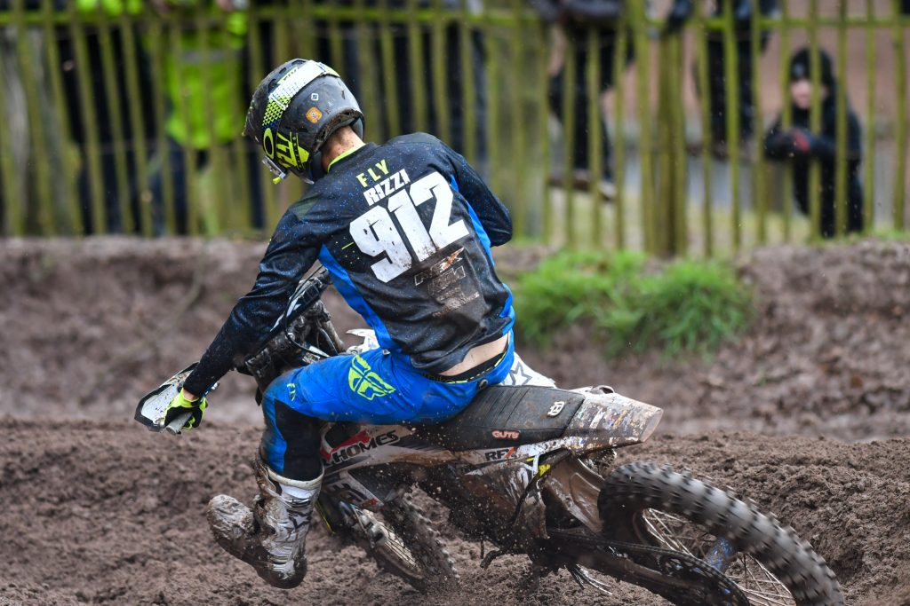

<figcaption>

125の2番手はJoel Rizziというライダー。16歳のイギリス人。リアムよりも体は大きい。

</figcaption>

</figure>

<figure>

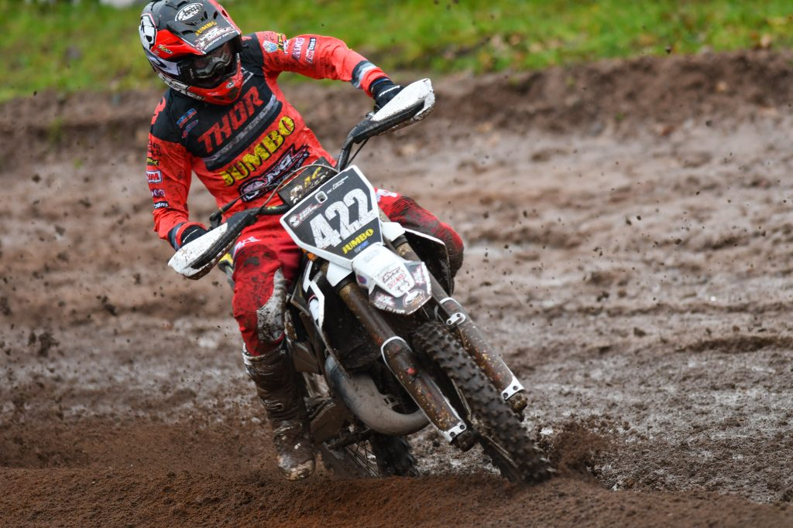

<figcaption>

125の3位はCamden Mc Lellanというライダー。僕はぜんぜん知らない。

</figcaption>

</figure>

<figure>

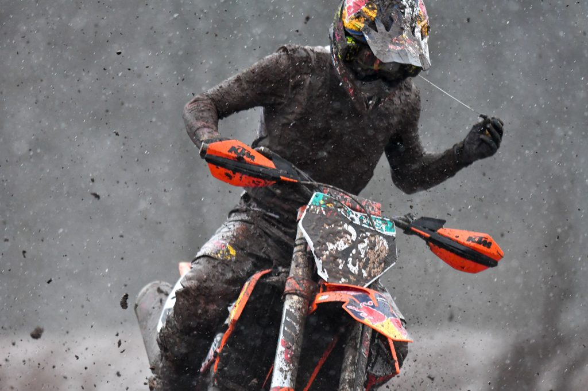

<figcaption>

MX2の総合トップはTom Vialle。今年はタイトル候補間違いないでしょうね。

</figcaption>

</figure>

<figure>

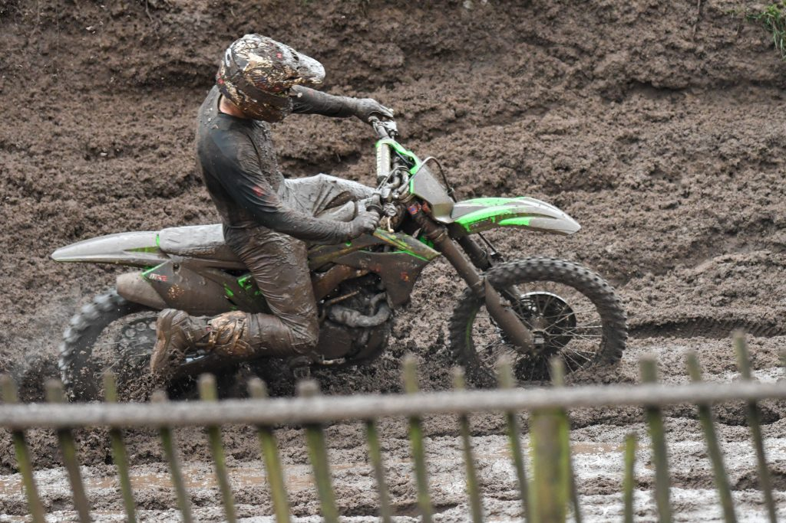

<figcaption>

2位はF&H期待の若手Mikkel Haarup。TKOと同じデンマーク出身。

</figcaption>

</figure>

<figure>

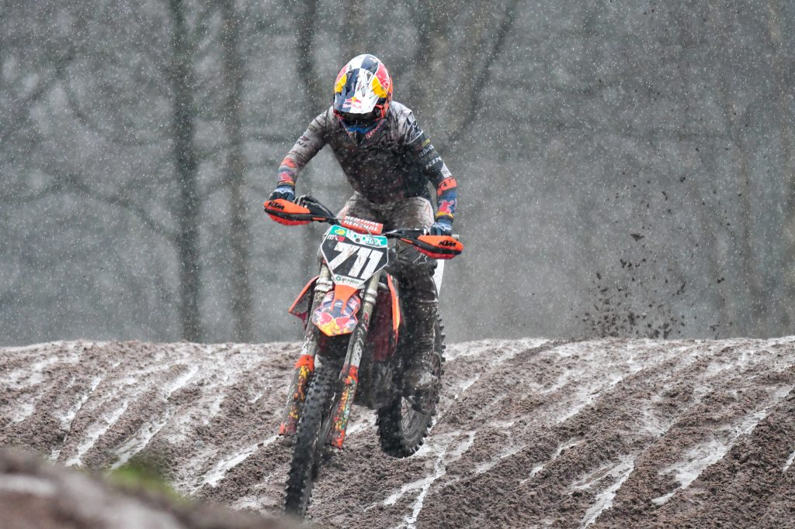

<figcaption>

3位はこれまたKTMファクトリーのRene Hofer。オーストリア人なので、KTMとしては期待の選手。

</figcaption>

</figure>

<figure>

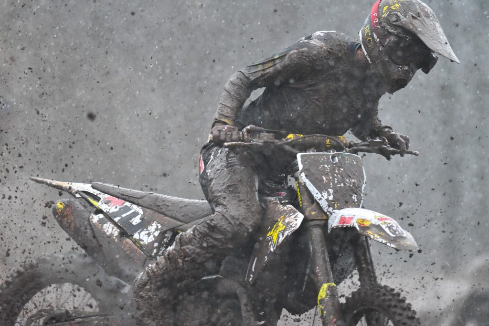

<figcaption>

4位はオーストラリア人のJed Beaton。ハスクバーナファクトリー。

</figcaption>

</figure>

<figure>

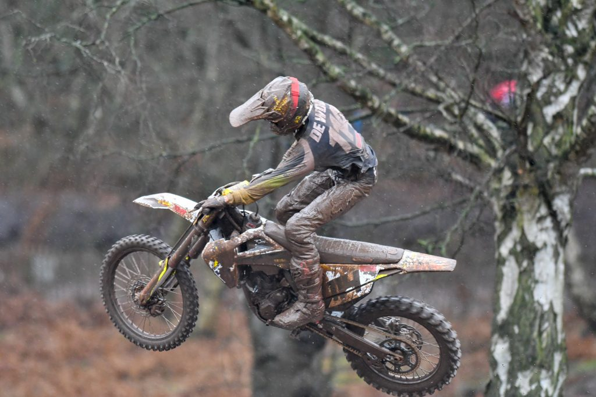

<figcaption>

総合5位に入ったのもハスクバーナの若手Kay de Wolf。アグレッシブなライディングが印象的。

</figcaption>

</figure>

<figure>

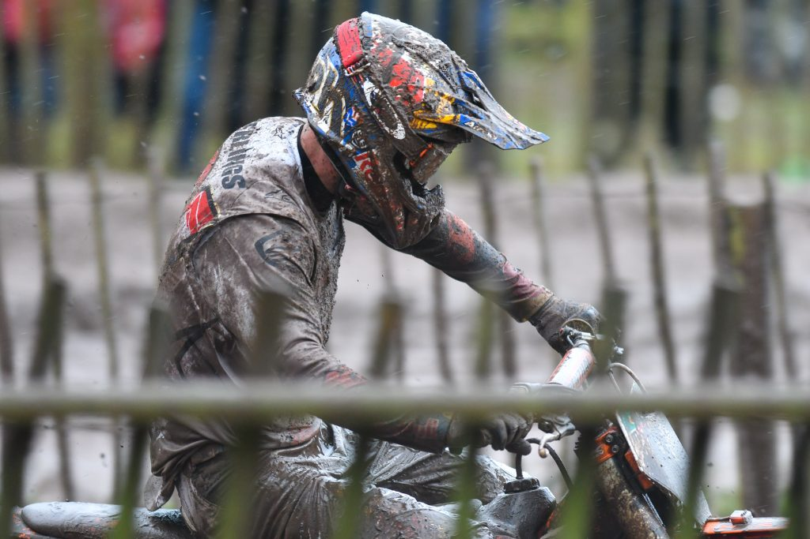

<figcaption>

MX1の総合優勝は3-1でジェフリー・ハーリングス。順当に勝ててよかった。マディは嫌いだと思ったけど。

</figcaption>

</figure>

<figure>

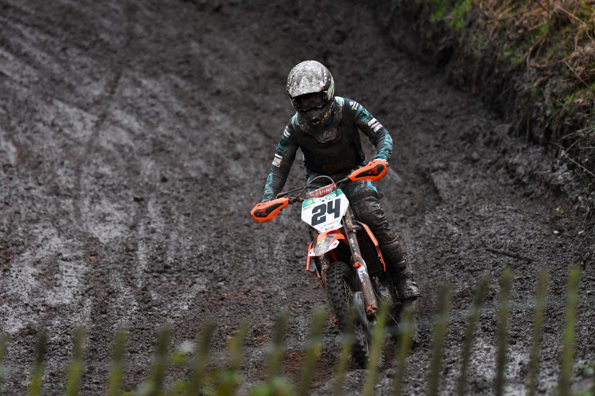

<figcaption>

2位は1-3でShaun Simpson。マディは得意だったと思う。GPでもマディのレースで勝ってるし。

</figcaption>

</figure>

<figure>

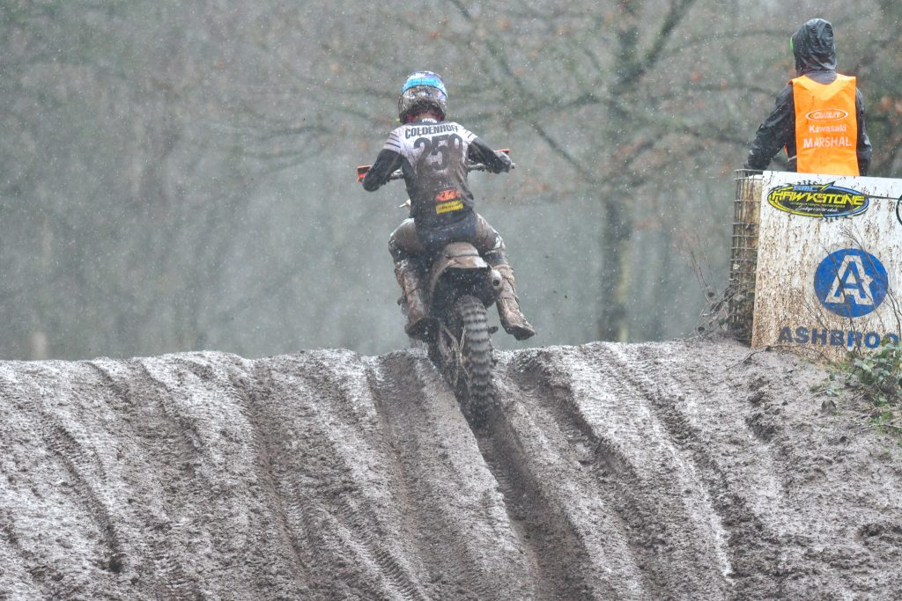

<figcaption>

3位は2-2でグレン・コールデンホフ。MXoNのときからの好調を維持しているように見えた。今年はタイトル争いできるかも。

</figcaption>

</figure>

<figure>

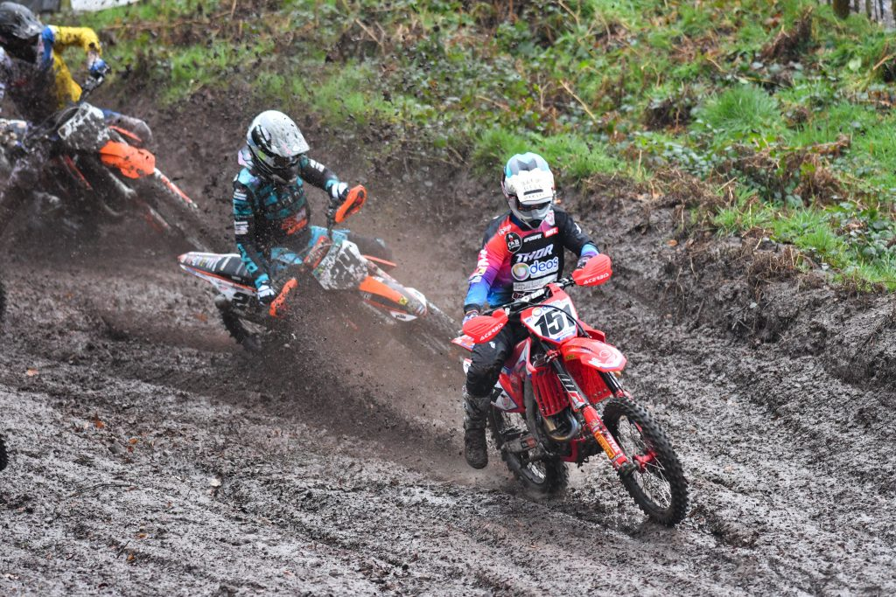

<figcaption>

4位はHarri Kullas。この写真はレース1のホールショット。MXoNのときも速かったから今年はいいかも。

</figcaption>

</figure>

<figure>

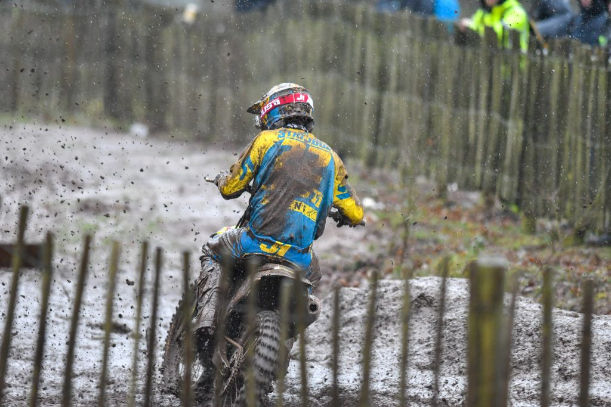

<figcaption>

ケビン・ストライボスが自分のチームでスズキに復帰。ファクトリーっぽいバイクでかっこいいです。

</figcaption>

</figure>
