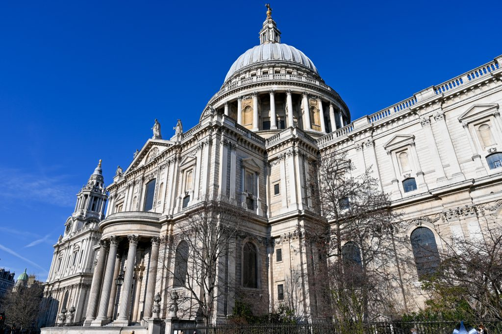
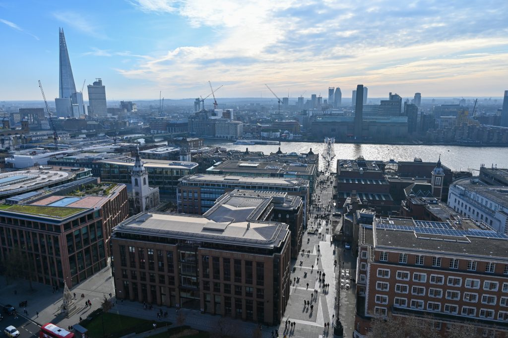
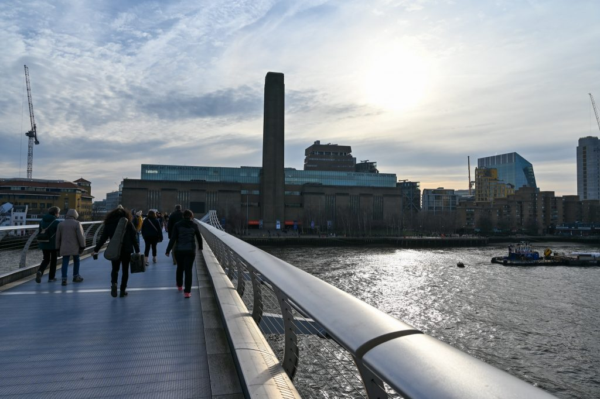
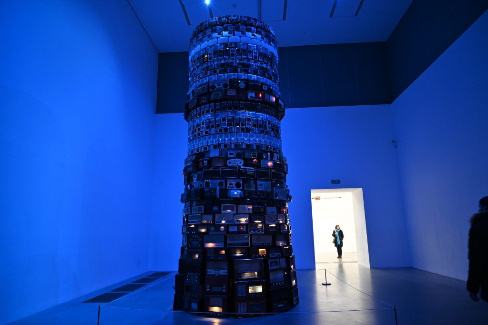
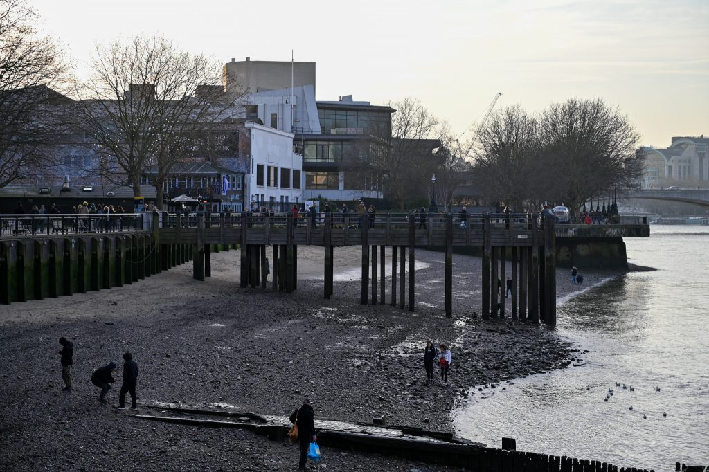
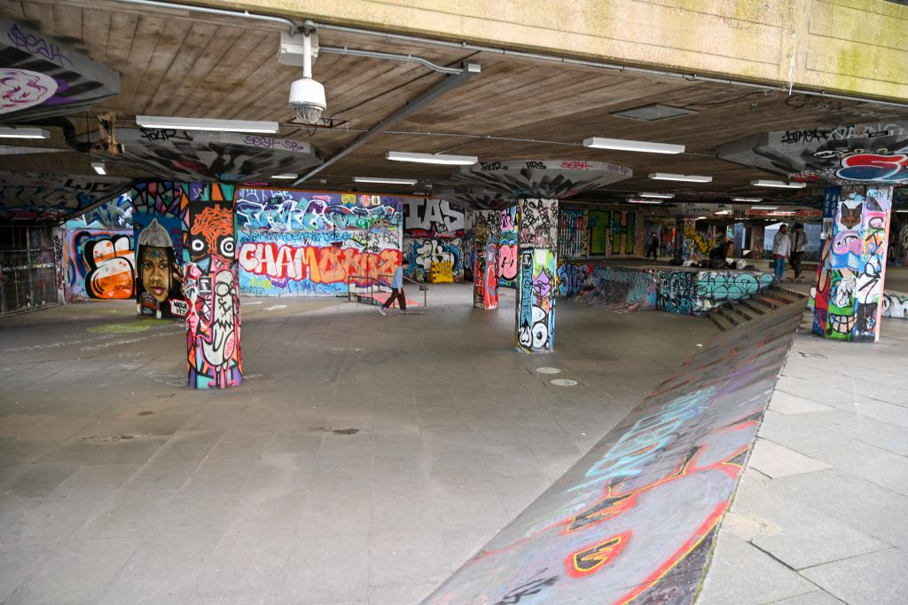
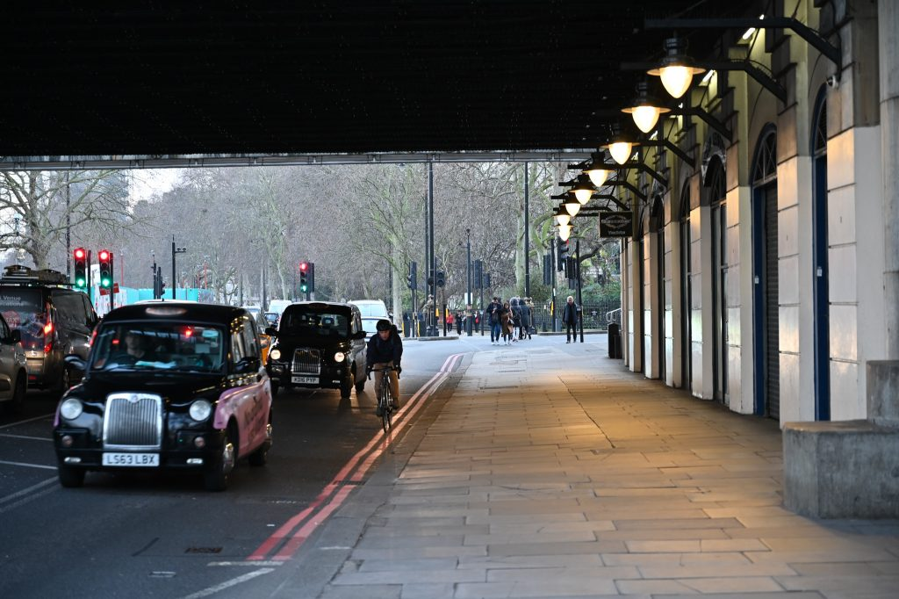

3年前のMXoNのとき以来のロンドン。前回見れなかったセント・ポール大聖堂やテートモダンを見に行ってみた。ロンドンの街を移動するなら地下鉄が便利。以前買ったオイスターカードを忘れずに持っていき、チャージして使った。また使える時が来るといいな。

<figure>

<figcaption>

セント・ポール大聖堂は大きい。特徴的なドーム型天井。上に登れるらしいので楽しみ。

</figcaption>

</figure>

<figure>

<figcaption>

階段を延々登って上から見た景色。素晴らしい眺めで登った甲斐があった。

</figcaption>

</figure>

<figure>

<figcaption>

ミレニアム・ブリッジを渡ってテートモダンへ移動。

</figcaption>

</figure>

<figure>

<figcaption>

テートモダンは現代アート美術館。中でもこれが印象的だった。ラジカセタワー？なんかわからないが凄い。

</figcaption>

</figure>

<figure>

<figcaption>

テートモダンを見たあとはテムズ川沿いを散歩。

</figcaption>

</figure>

<figure>

<figcaption>

スケートパークがあった。この落書き？は誰が書くんでしょうね？

</figcaption>

</figure>

<figure>

<figcaption>

日も暮れたし、地下鉄で帰ります。

</figcaption>

</figure>
