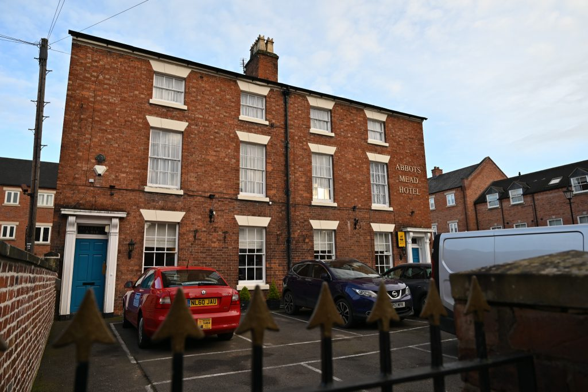
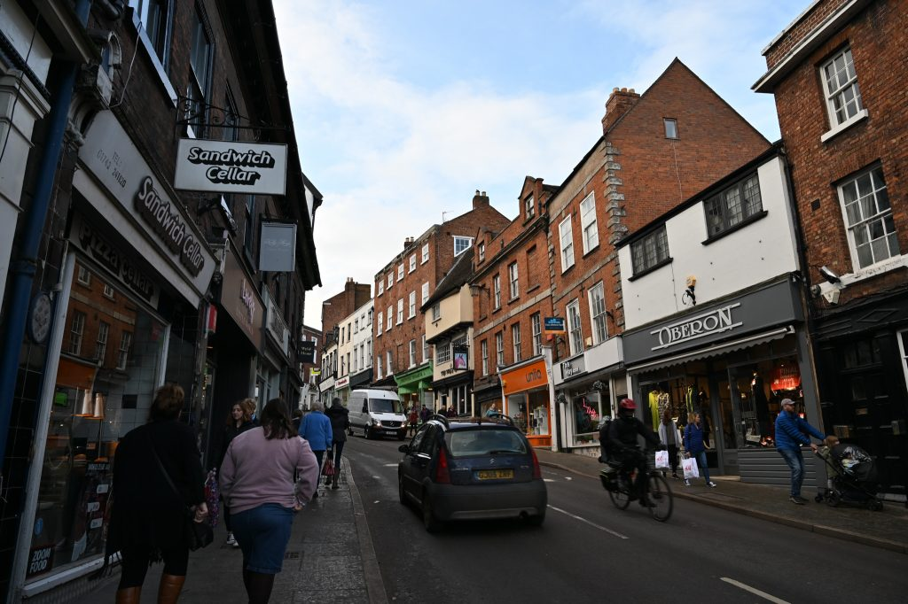
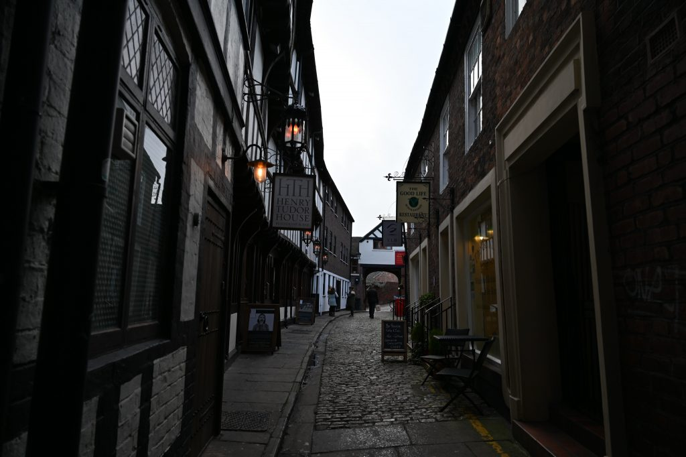
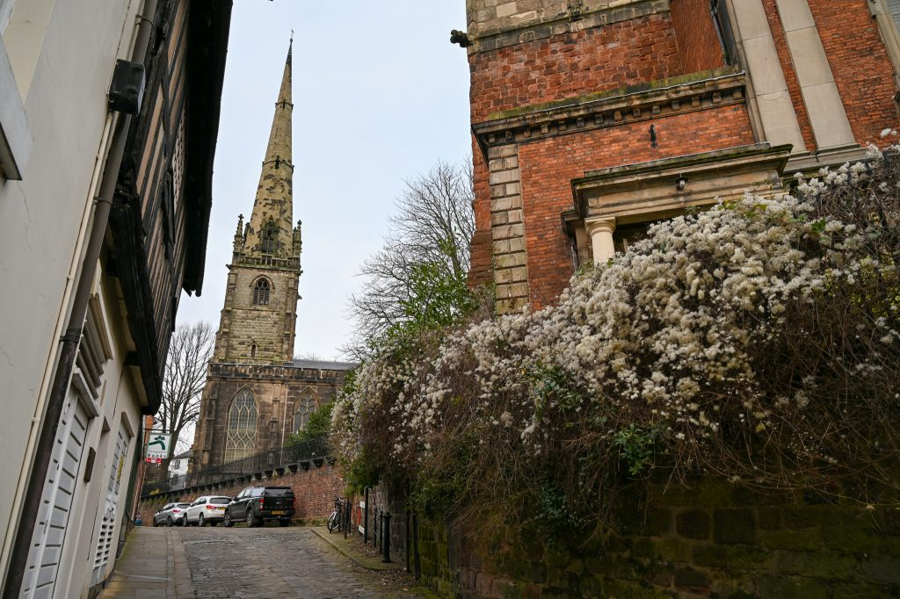
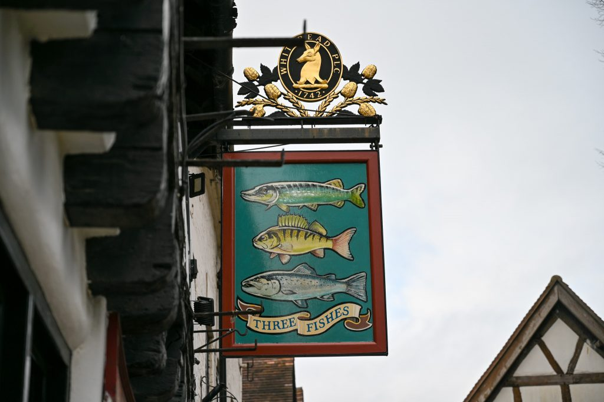
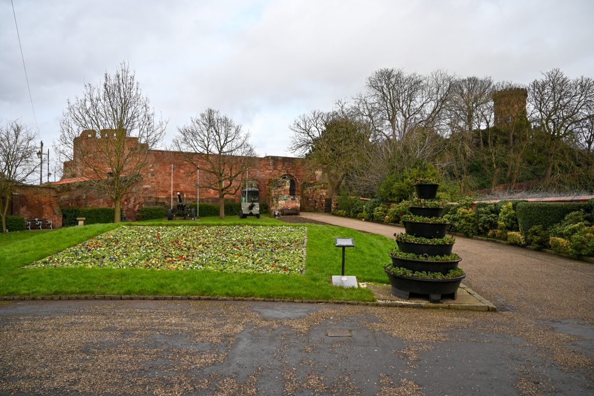
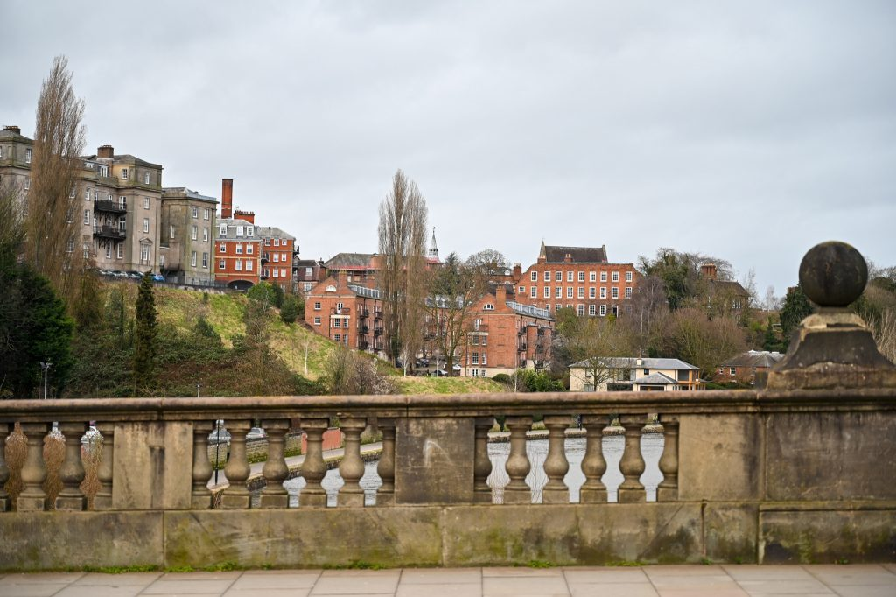

シュルーズベリーはホークストーンパークの最寄りの街なので、レースを観戦するならここに泊まるのが良い。ホークストーンパークまではだいたい車で30分くらいの距離。小さな街だけどなかなか素敵だったし、ホテルの人もとても親切だった。

<figure>

<figcaption>

これが今回泊まったアポッツミードホテル。外観はレンガ造り。目の前に駐車場があるのでこのホテルにしたけど正解だった。

</figcaption>

</figure>

<figure>

<figcaption>

シュルーズベリーは坂が多い。

</figcaption>

</figure>

<figure>

<figcaption>

路地もなかなか雰囲気があって良い。

</figcaption>

</figure>

<figure>

<figcaption>

向こうに見えるのは教会。

</figcaption>

</figure>

<figure>

<figcaption>

3匹の魚たちの看板。パブかな？

</figcaption>

</figure>

<figure>

<figcaption>

これがシュルーズベリーの頂上付近にある城跡。シュルーズベリーは城下町なんですね。

</figcaption>

</figure>

<figure>

<figcaption>

そして街をぐるっと川が取り囲んでる。これなら攻め入るのは難しいかったのではないかと思う。

</figcaption>

</figure>
