今年も下田丈選手が日本に帰ってきてレースをしてくれるとのことで、何度も行ってるオフロードビレッジに行ってきました。正直なところ、ここは観戦するにはちょっとつまらないトラックなんですよね。どこから見てもだいたい選手のほうが高い位置になってしまうので、見上げるような形になってしまう。だから本当はもっとたくさん観客席を用意してほしいんだけど、それもなかなか難しいでしょうね。まあ、でも贅沢は言いません。日本でAMAトップレベルの走りが見られるだけでも良しとしましょう。

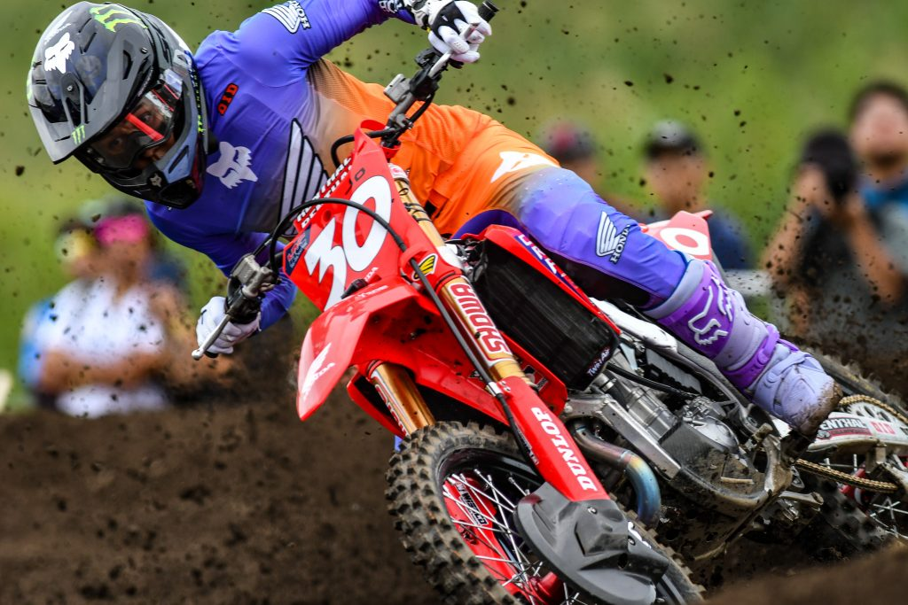

下田選手は他とは明らかに違うフォームで本当にかっこいいです。

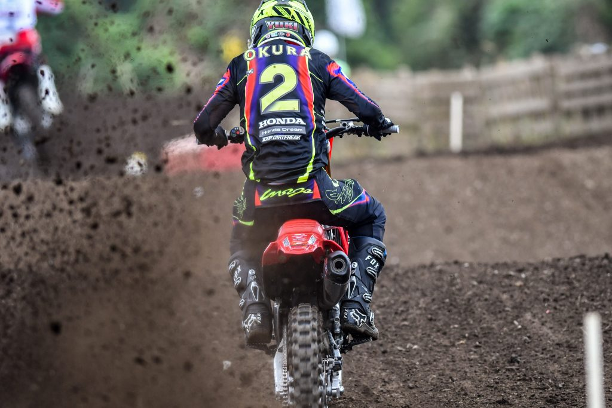

大倉選手は今年のネイションズ代表。ちょうどこれを書いてる今日と明日にありますが、今年は予選通過できるかな？

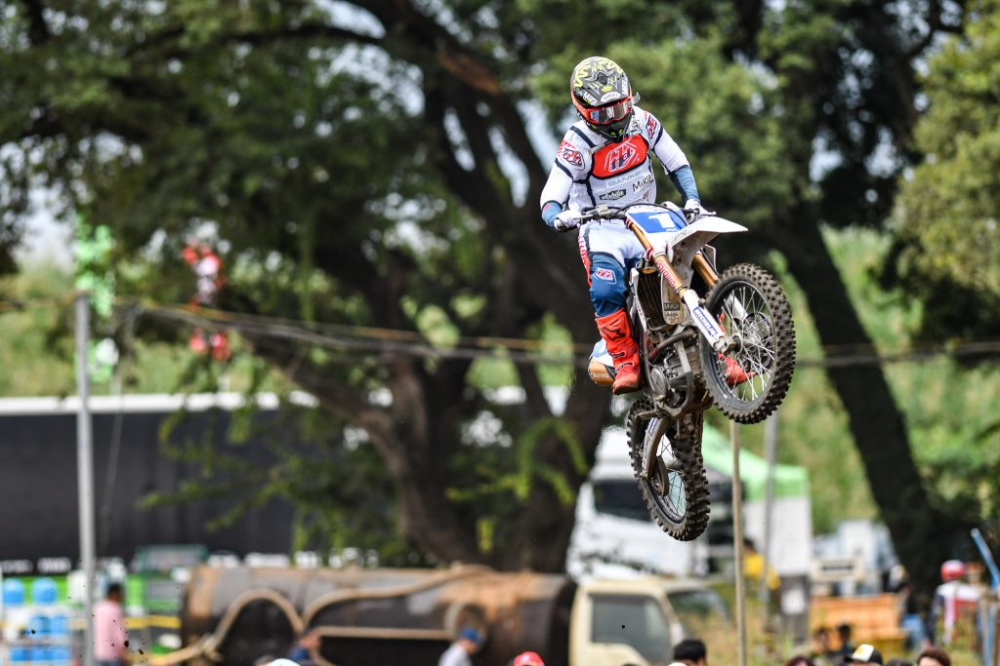

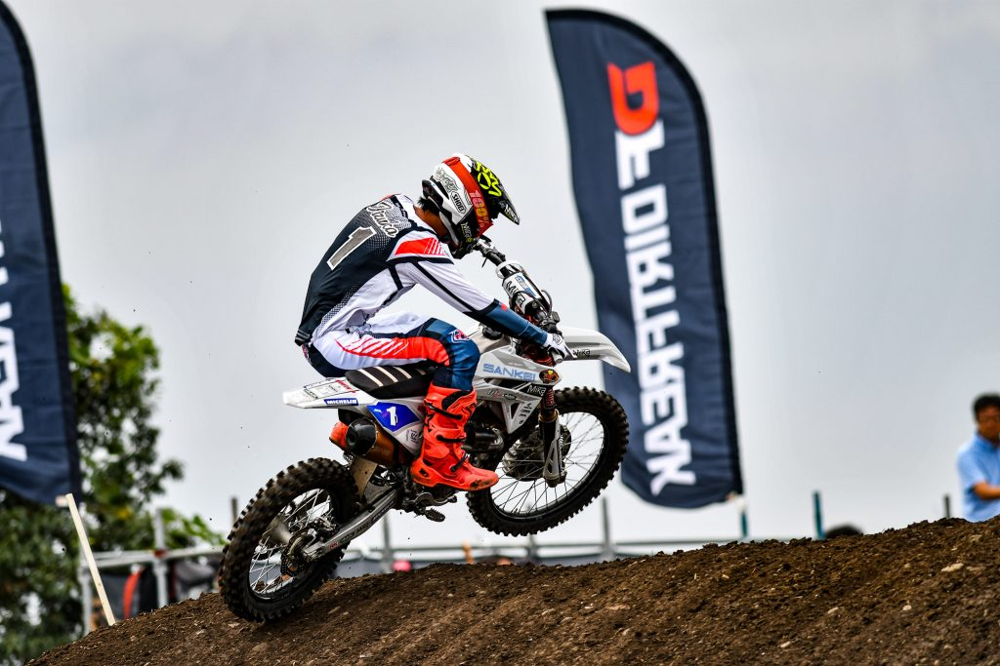

最近の全日本モトクロスに行く楽しみの一つがIB-OPENです。エンデューロも頑張っていたつばっちこと飯塚選手が今年はゼッケン1番。現在、ランキング2位なので来年は確実にIAに昇格ですね。

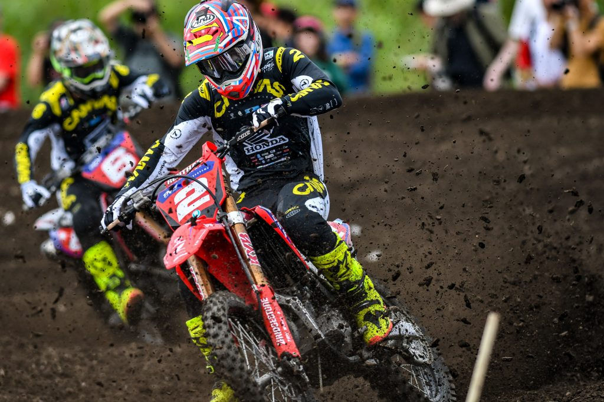

IA2のゼッケン2番は横澤選手。ランキング1位。

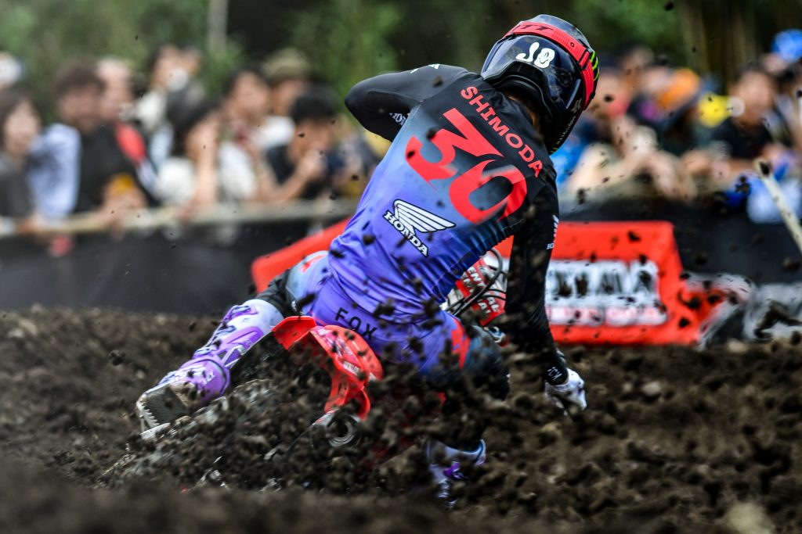

後ろ姿も絵になる下田選手。

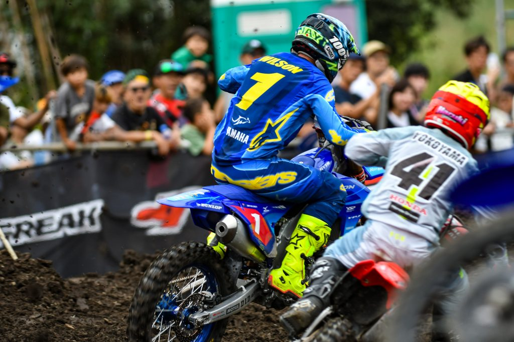

ジェイ・ウイルソン選手と横山選手のバトルが見ていて楽しかったです。

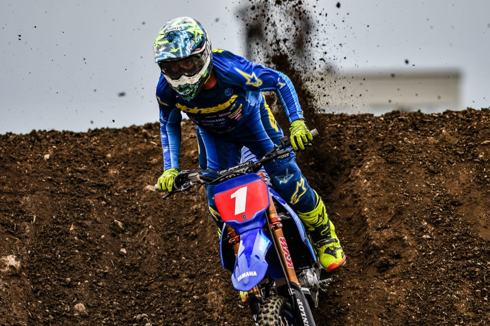

今年もチャンピオンはこの人。ジェイ・ウイルソン選手。なんか話が長いとか言われてましたね（笑）

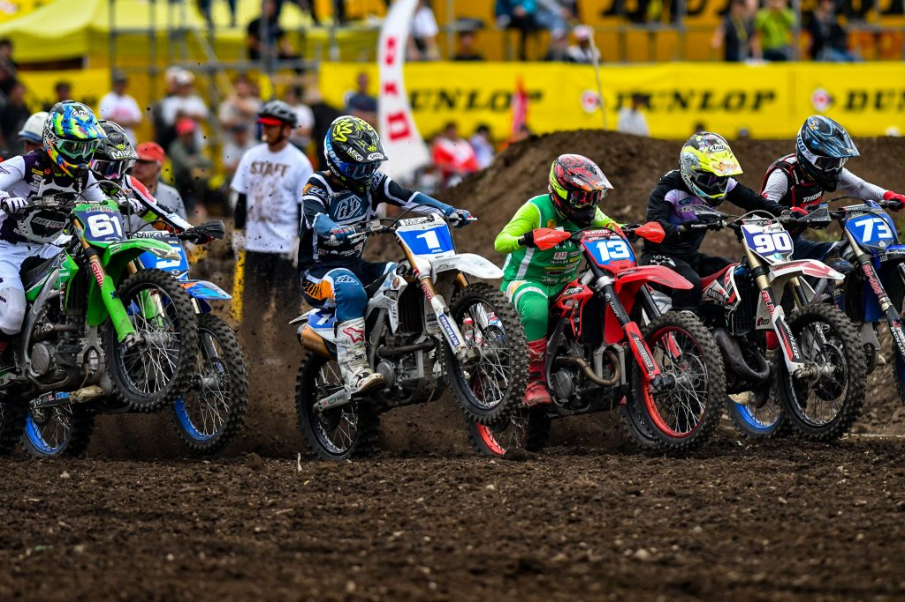

今回、つばっちはスタートもバッチリ決まることが多かったですね。

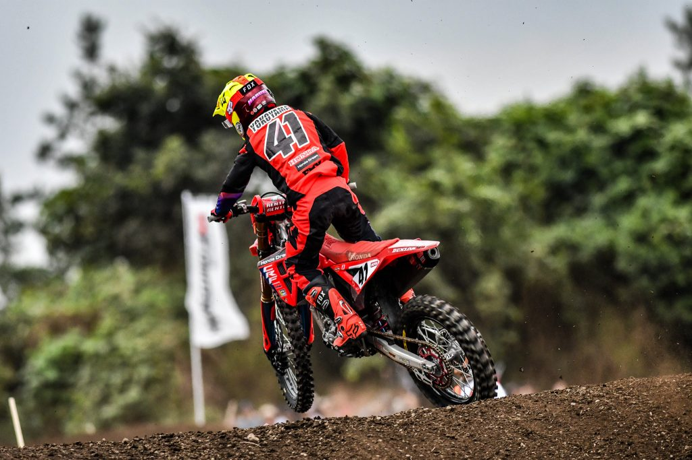

横山選手は体が小さいためか？全体的に突っ張った乗り方に見えます。

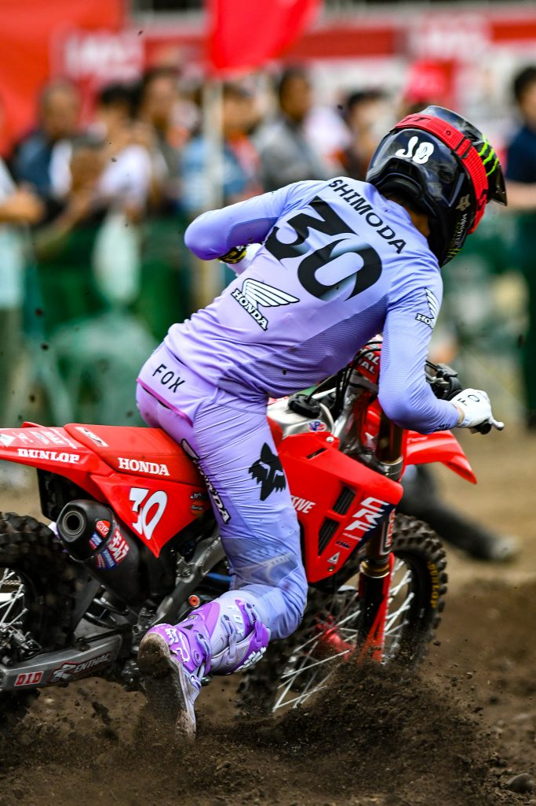

いやー、ほんとかっこいい。

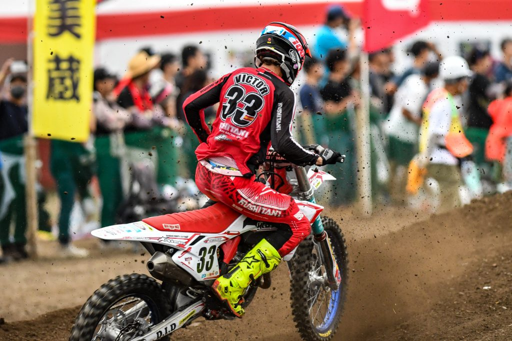

ビクトル・アロンソ選手のガスガスは白い外装でした。

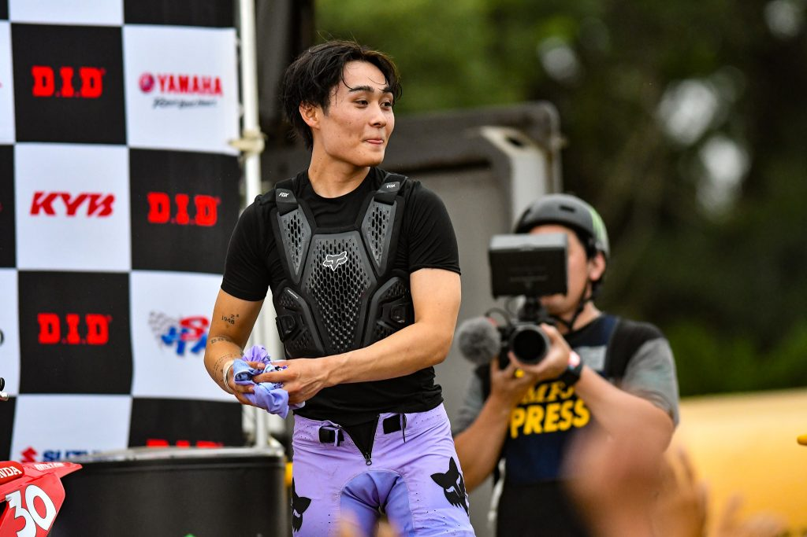

ジャージもらった人、ラッキーですねー。

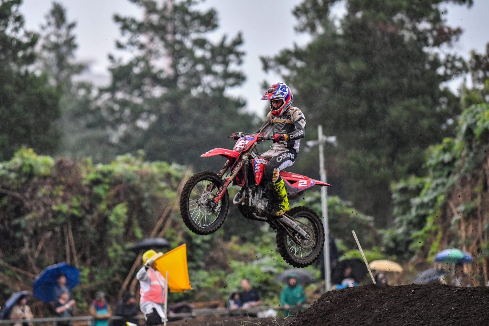

最後のレースはIA2でしたが、突然雨が降ってきて路面状況が一変しました。ゴーグルなしはしんどい。
