台湾有事が起こったら行けなくなるかもしれないと思って、ゴールデンウィークに台湾に行ってきました。行ってみて感じたのはみんな優しいし、日本語を話してくれる人も結構いて、とてもいいところだなと。これがヨーロッパだとそうはいかなくて、たまに嫌な思いもするし、常にスリに気をつけていないといけないし、緊張しながらの旅になるんだけど、台湾ならそんな心配はいりません。また行きたいな。

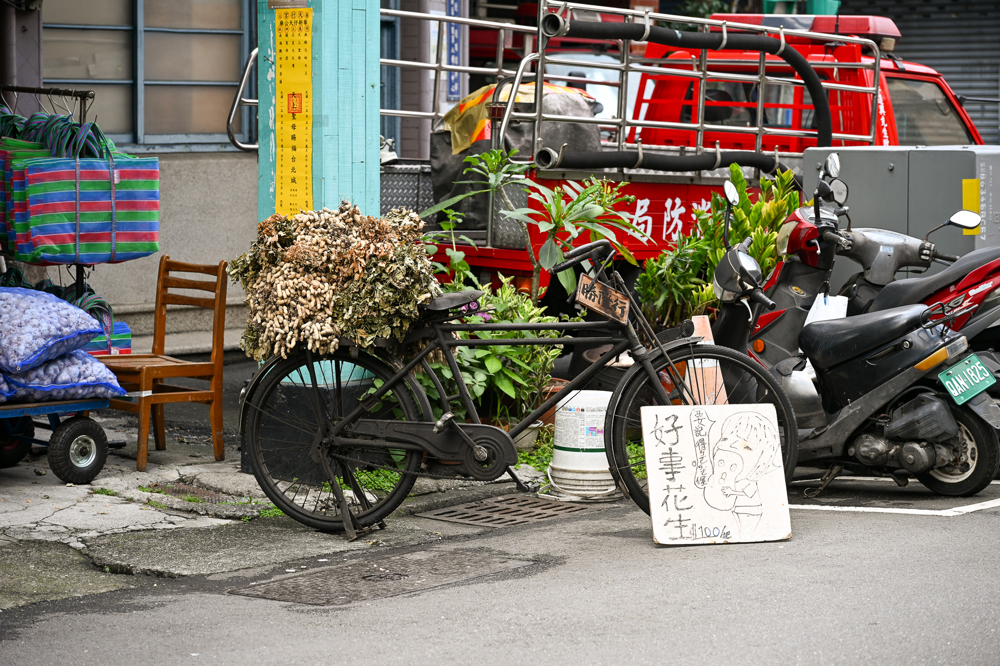

古い自転車にたくさんの落花生かな？を積んでる。イラストが面白い。

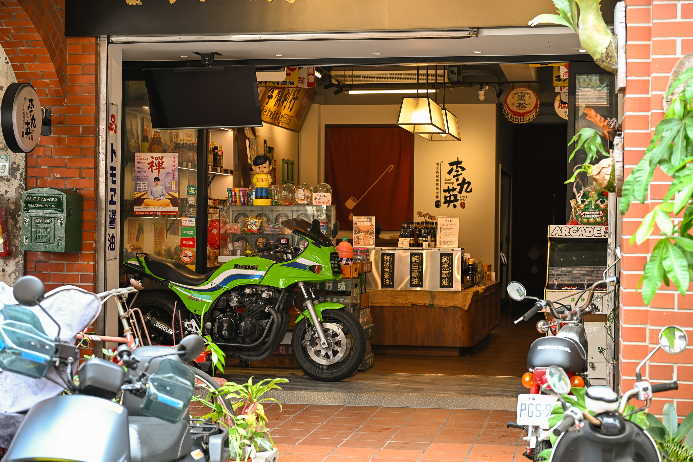

きれいなGPZがお店の中に止めてあった。

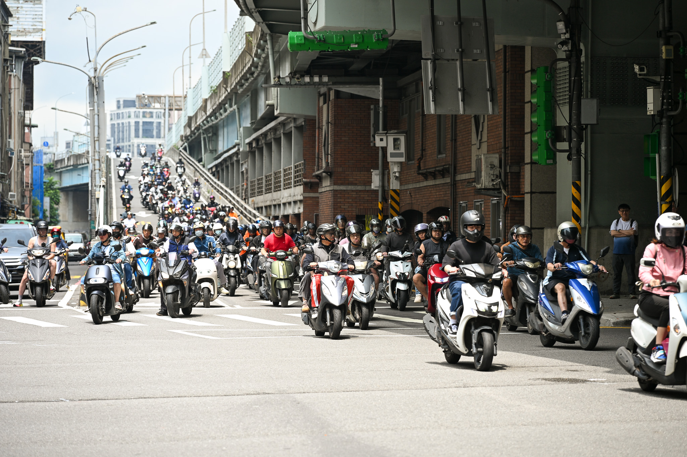

台北名物？のバイクの滝。お昼時だったのでそこまで台数は多くなかった。

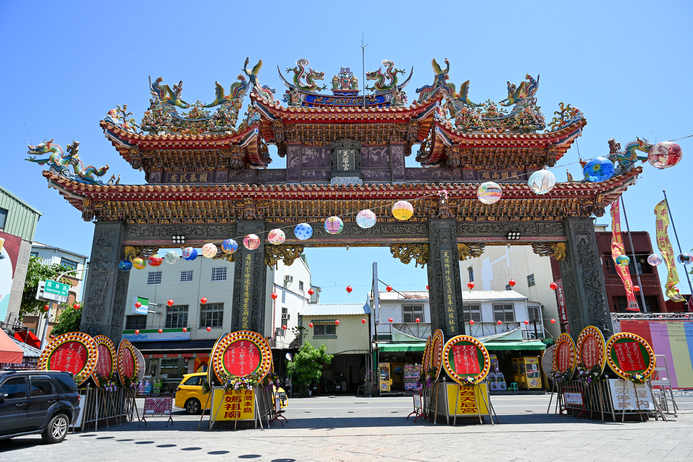

これは台南の安平。色使いが派手。

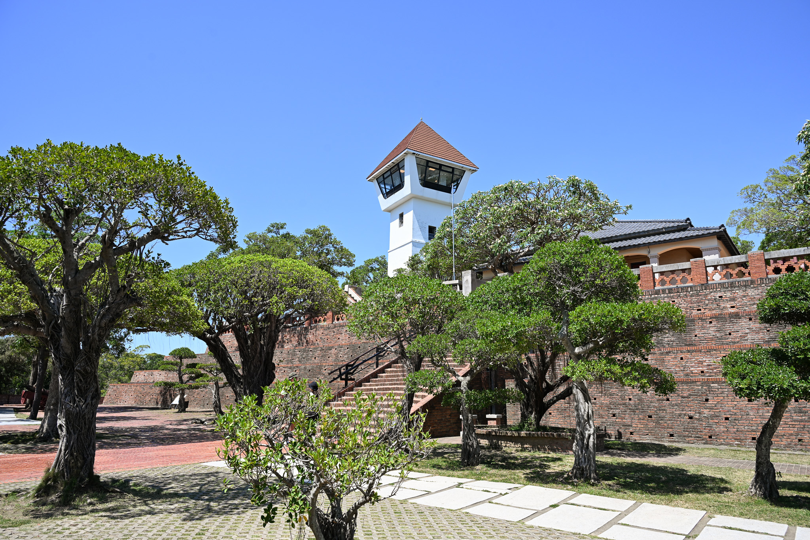

安平古堡。南国らしい。

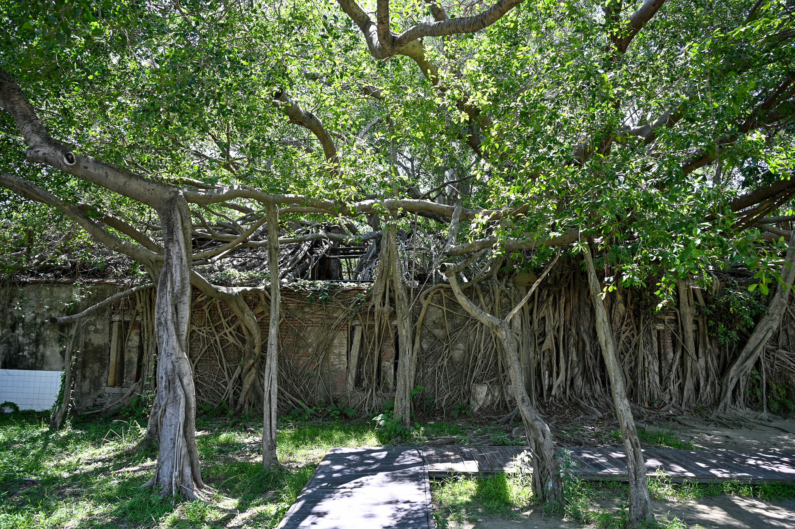

安平樹屋。ガジュマルに侵食された家？

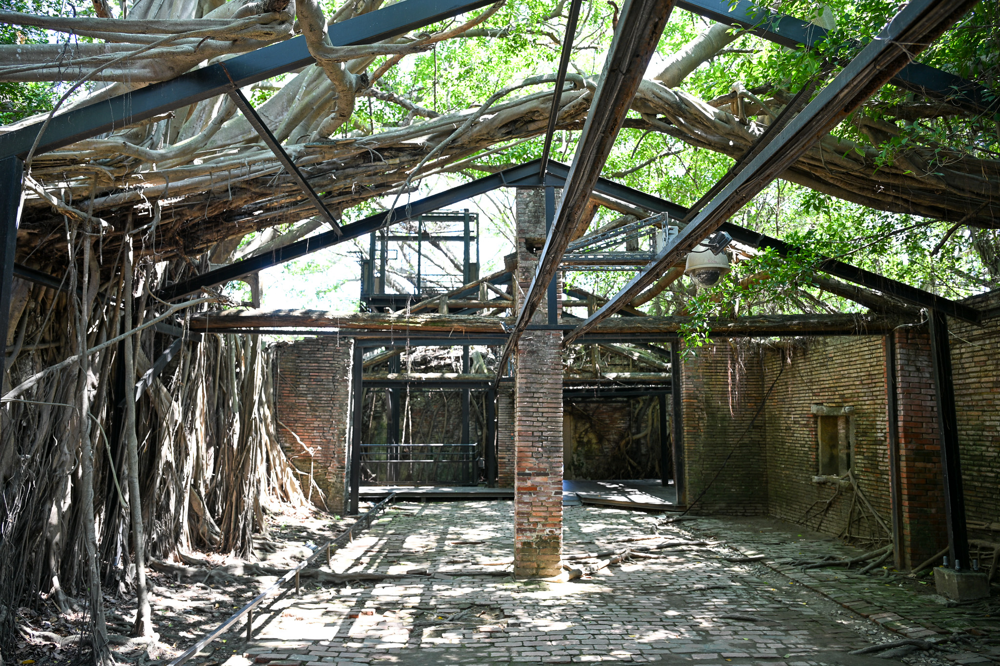

中はこんな感じで、家を支えるために鉄骨が組んである。

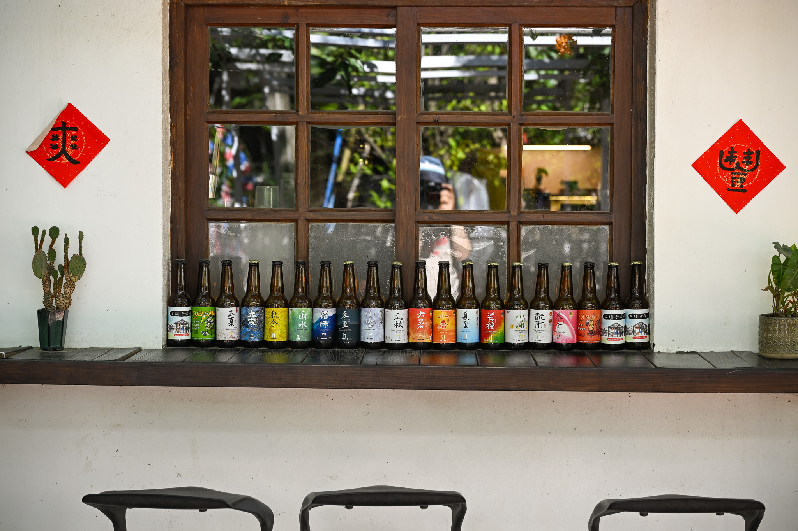

カフェの外にビールの瓶かな？が並べてあったので撮ってみた。

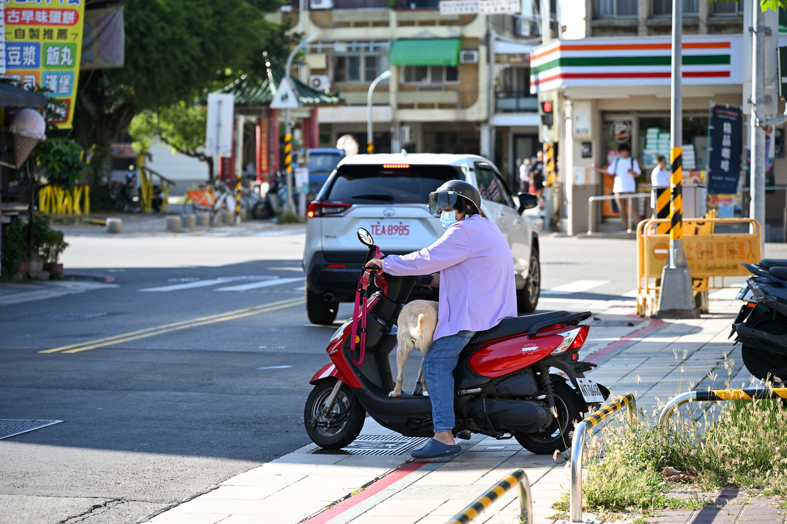

スクーターに乗ろうとしてるおばちゃんが犬のリードを外していたので、どうするのかと思ったら犬もスクーターに乗っていった。

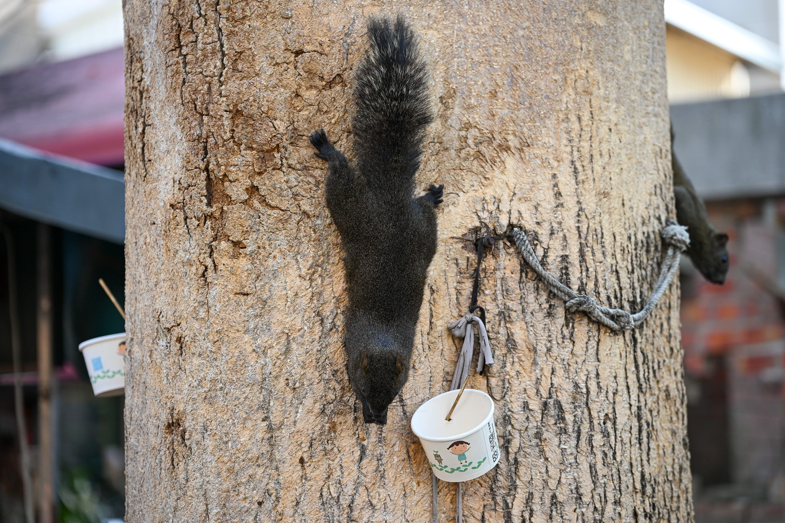

木になんかいるなと思ったら、リスだった。黒いので可愛くない。

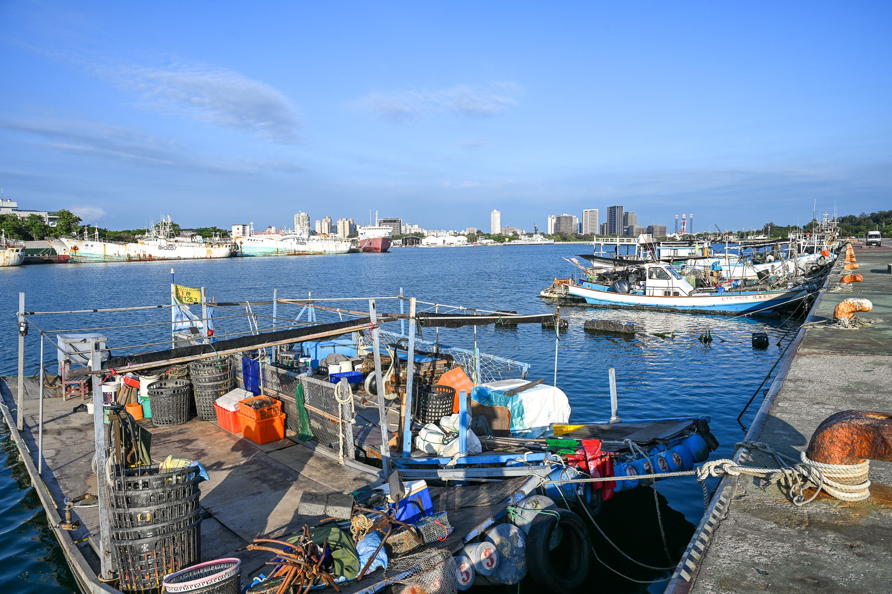

海の方に行ってみた。

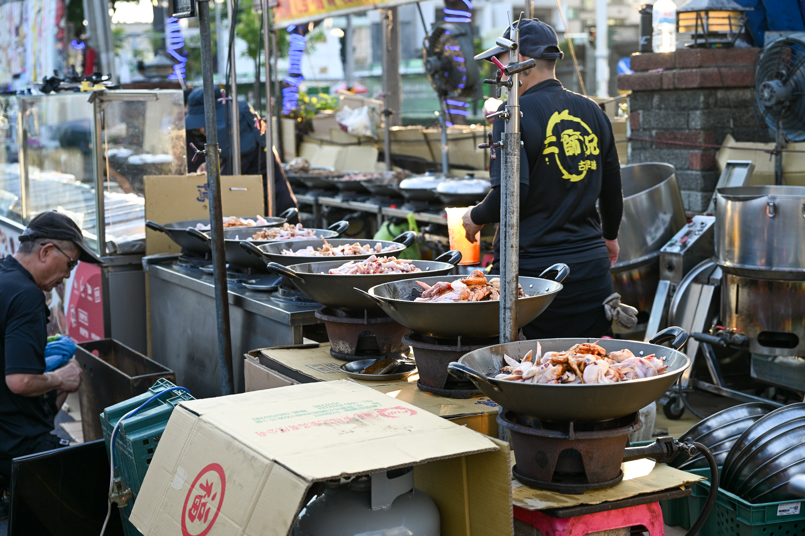

花園夜市。鳥のいろんな部位を黒い液体につけていた。

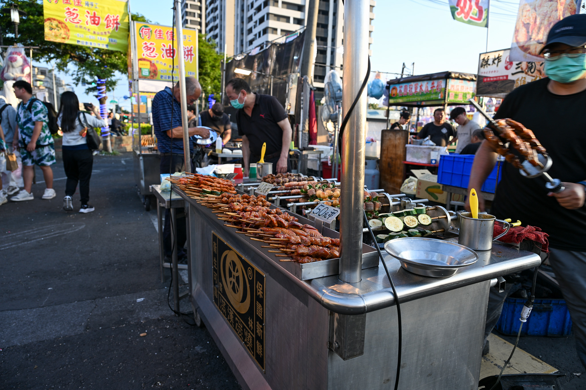

夜市は楽しい。

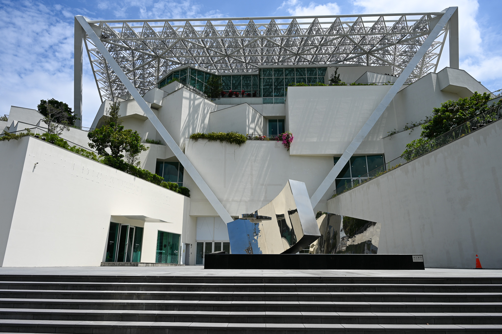

台南市の美術館

美術館の中も立派だった。
